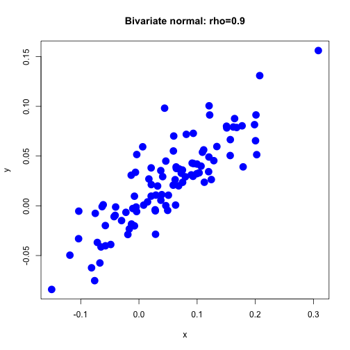
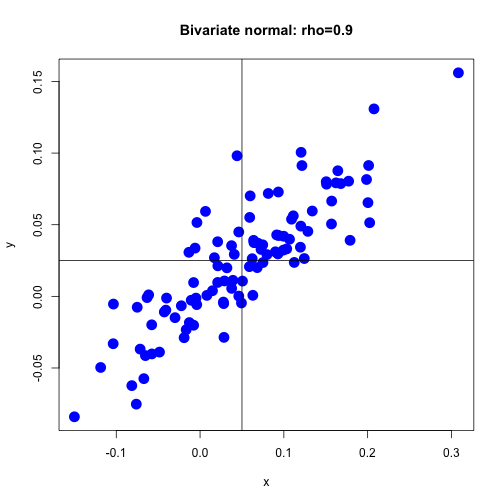

# Coursera: Intro to Computational Finance: Assignment 3: R Lab: BiVariate Probabilities


[https://class.coursera.org/compfinance-009/courservice/lti/v1/975440/29](https://class.coursera.org/compfinance-009/courservice/lti/v1/975440/29)

[https://campus.datacamp.com/courses/computational-finance-and-financial-econometrics-with-r/lab-3-bivariate-distributions?ex=1](https://campus.datacamp.com/courses/computational-finance-and-financial-econometrics-with-r/lab-3-bivariate-distributions?ex=1)


1\. Compute the covariance between XX and YY and assign it to sig_xy.
Construct the covariance matrix and assign it to Sigma_xy.


```r
    # Standard deviations and correlation
    sig_x <- 0.10
    sig_y <- 0.05
    rho_xy <- 0.9
    
    # Covariance between X and Y
    sig_xy <- rho_xy * sig_x * sig_y
    
    # Covariance matrix
    Sigma_xy <- matrix( c(sig_x^2, sig_xy, sig_xy, sig_y^2), nrow=2, ncol=2, byrow=T )
```

2\. Simulate 100 observations from the bivariate normal distributed random
variables X and Y. Use the covariance matrix Sigma_xy from the previous
exercise and suppose that the means are µX=0.05 and μY=0.025.

Assign the result to xy_vals.
Have a look at the first few observations with the head() function.


```r
    # Load the mvtnorm package
    # install.packages("mvtnorm")
    library("mvtnorm")
    
    # Means
    mu_x <- 0.05
    mu_y <- 0.025
    
    # Simulate 100 observations
    set.seed(123)  # for reproducibility
    xy_vals <- rmvnorm(100, mean = c(mu_x, mu_y), sigma = Sigma_xy)
      
    # Have a look at the first observations
    head(xy_vals)
```

```
##             [,1]         [,2]
## [1,] -0.01055124 -0.002720223
## [2,]  0.19865393  0.081562113
## [3,]  0.12156743  0.091291081
## [4,]  0.04939103 -0.004618093
## [5,] -0.02987387 -0.014866126
## [6,]  0.17729184  0.080391233
```

3\. Create a scatterplot of the simulated observations.

Customize the plot in the following way: specify the plot symbol with pch = 16,
set the symbol size to 2, set the color to "blue", use the title "Bivariate
normal: rho=0.9", and use the axis labels "x" and "y".


```r
    plot(x=xy_vals[,1], 
         y=xy_vals[,2], 
         pch=16, 
         cex=2, 
         col="blue", 
         main="Bivariate normal: rho=0.9",
         xlab="x",
         ylab="y")
```




4\. Add a vertical line that indicates the mean of X and a horizontal line that
indicates the mean of Y.


```r
    plot(x=xy_vals[,1], 
         y=xy_vals[,2], 
         pch=16, 
         cex=2, 
         col="blue", 
         main="Bivariate normal: rho=0.9",
         xlab="x",
         ylab="y")
    abline(h=mu_y, v=mu_x)
```



5\. Compute the joint probability Pr(X <= 0,Y <= 0).


```r
    pmvnorm( lower=c(-Inf, -Inf), upper=c(0,0), mean=c(mu_x, mu_y), sigma=Sigma_xy )
```

```
## [1] 0.2453259
## attr(,"error")
## [1] 1e-15
## attr(,"msg")
## [1] "Normal Completion"
```

## Quiz questions


1\. Consider the two random variables X and Y with μX=0.05 and
μY=0.025, σX=0.10, σY=0.05. The correlation between X and Y is ρXY.


3\. If rho_xy=0.9 what is Pr(X<=0,Y<=0)?


    mu_x = 0.05
    sig_x <- 0.10

    mu_y = 0.025
    sig_y <- 0.05

    rho_xy <- 0.9

    # Correlation matrix (as opposed to Covariance matrix)
    rho_xy.mat <- matrix( c(1.0, rho_xy, rho_xy, 1.0), nrow=2, ncol=2, byrow=T )
    
    pmvnorm( lower=c(-Inf, -Inf), 
             upper=c(0,0), 
             mean=c(mu_x, mu_y), 
             corr=rho_xy.mat )
    # [1] 0.4132            # NOTE: this somehow needs to be converted using sig_x, sig_y (or something)
    # attr(,"error")
    # [1] 1e-15
    # attr(,"msg")
    # [1] "Normal Completion"


    # Covariance between X and Y
    sig_xy <- rho_xy * sig_x * sig_y
    
    # Covariance matrix
    Sigma_xy <- matrix( c(sig_x^2, sig_xy, sig_xy, sig_y^2), nrow=2, ncol=2, byrow=T )


    pmvnorm( lower=c(-Inf, -Inf), 
             upper=c(0,0), 
             mean=c(mu_x, mu_y), 
             sigma=Sigma_xy )
    # [1] 0.2453
    # attr(,"error")
    # [1] 1e-15
    # attr(,"msg")
    # [1] "Normal Completion"

4\. If rho_xy=0 what is Pr(X<=0,Y<=0)?


    mu_x = 0.05
    sig_x <- 0.10

    mu_y = 0.025
    sig_y <- 0.05

    rho_xy <- 0

    # Covariance between X and Y
    sig_xy <- rho_xy * sig_x * sig_y
    
    # Covariance matrix
    Sigma_xy <- matrix( c(sig_x^2, sig_xy, sig_xy, sig_y^2), nrow=2, ncol=2, byrow=T )

    pmvnorm( lower=c(-Inf, -Inf), 
             upper=c(0,0), 
             mean=c(mu_x, mu_y), 
             sigma=Sigma_xy )
    # [1] 0.0952
    # attr(,"error")
    # [1] 1e-15
    # attr(,"msg")
    # [1] "Normal Completion"


5\. If rho_xy=-0.9 what is Pr(X<=0,Y<=0)?

    mu_x = 0.05
    sig_x <- 0.10

    mu_y = 0.025
    sig_y <- 0.05

    rho_xy <- -0.9

    # Covariance between X and Y
    sig_xy <- rho_xy * sig_x * sig_y
    
    # Covariance matrix
    Sigma_xy <- matrix( c(sig_x^2, sig_xy, sig_xy, sig_y^2), nrow=2, ncol=2, byrow=T )


    pmvnorm( lower=c(-Inf, -Inf), 
             upper=c(0,0), 
             mean=c(mu_x, mu_y), 
             sigma=Sigma_xy )
    # [1] 0.0008029
    # attr(,"error")
    # [1] 1e-15
    # attr(,"msg")
    # [1] "Normal Completion"
