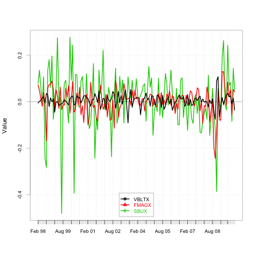
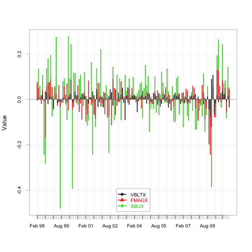
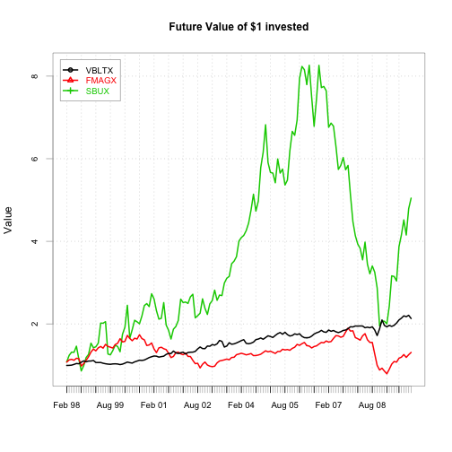
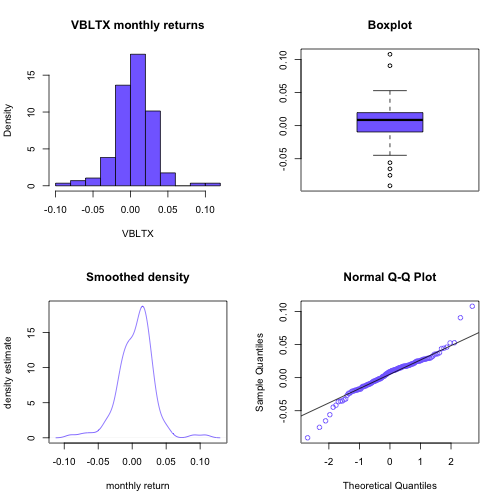
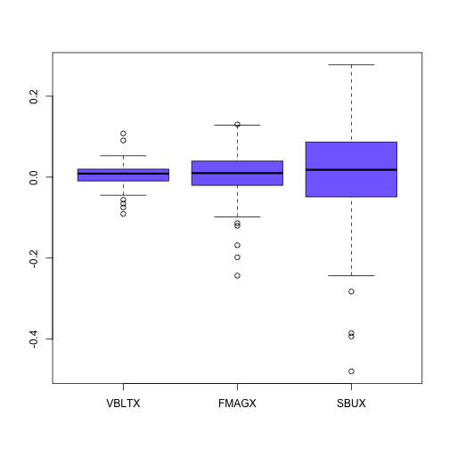
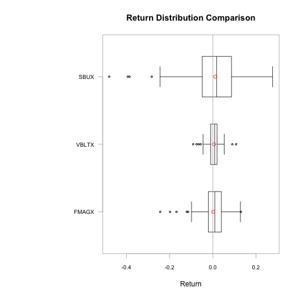
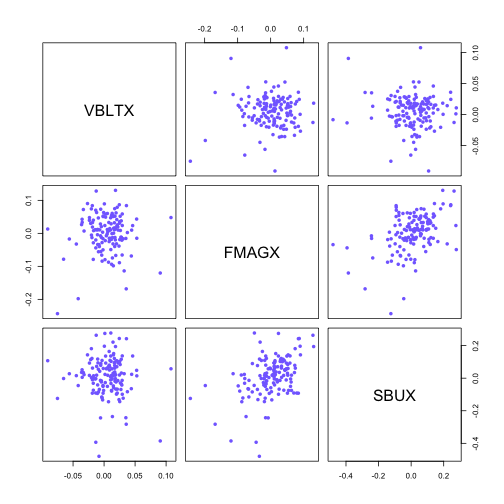

# Coursera: Intro to Computational Finance: Assignment 5-R: Analyzing stock returns

1\. Assign to SBUX_prices the prices of the Starbucks stock in the same way as
VBLTX and FMAGX.

Change the class of the index of SBUX_prices with the as.yearmon() function.

Print the start and the end of the time series to the console by applying the
start() and end() functions on one of the price time series.


```r
    # install.packages("PerformanceAnalytics")
    # install.packages("zoo")
    # install.packages("tseries")

    library(PerformanceAnalytics)
    library(zoo)
    library(tseries)

    # Get the monthly adjusted closing price data on VBLTX, FMAGX and SBUX from
    # Yahoo! using the tseries function get.hist.quote(). Set the sample to Jan
    # 1998 through Dec 2009.

    # Get the adjusted closing prices from Yahoo!
    VBLTX_prices <- get.hist.quote(instrument="vbltx", 
                                   start="1998-01-01",
                                   end="2009-12-31", 
                                   quote="AdjClose",
                                   provider="yahoo", 
                                   origin="1970-01-01",
                                   compression="m", 
                                   retclass="zoo", 
                                   quiet=TRUE)
                         
    FMAGX_prices <- get.hist.quote(instrument="fmagx", 
                                   start="1998-01-01",
                                   end="2009-12-31", 
                                   quote="AdjClose",
                                   provider="yahoo", 
                                   origin="1970-01-01",
                                   compression="m", 
                                   retclass="zoo", 
                                   quiet=TRUE)

    SBUX_prices <- get.hist.quote(instrument="sbux", 
                                   start="1998-01-01",
                                   end="2009-12-31", 
                                   quote="AdjClose",
                                   provider="yahoo", 
                                   origin="1970-01-01",
                                   compression="m", 
                                   retclass="zoo", 
                                   quiet=TRUE)

    
    # Change the class of the time index to yearmon which is appropriate for monthly data
    # index() and as.yearmon() are functions in the zoo package  
    
    index(VBLTX_prices) <- as.yearmon(index(VBLTX_prices))
    index(FMAGX_prices) <- as.yearmon(index(FMAGX_prices))
    index(SBUX_prices) <- as.yearmon(index(SBUX_prices))

    start(SBUX_prices)
```

```
## [1] "Jan 1998"
```

```r
    end(SBUX_prices)
```

```
## [1] "Dec 2009"
```

2\. Assign to all_prices the merged price series VBLTX_prices, FMAGX_prices,
SBUX_prices such that each column contains the prices of one stock.

Calculate the continuously compounded returns with the help of the diff() and
log() functions.

Have a look at the data in the console.


```r
    # Create merged price data
    all_prices = merge(VBLTX_prices, FMAGX_prices, SBUX_prices)

    # Rename columns
    colnames(all_prices) <- c("VBLTX", "FMAGX", "SBUX")
    
    # Calculate cc returns as difference in log prices
    all_returns = diff( log( all_prices ) )
    
    # Look at the return data
    start(all_returns)
```

```
## [1] "Feb 1998"
```

```r
    end(all_returns)
```

```
## [1] "Dec 2009"
```

```r
    colnames(all_returns) 
```

```
## [1] "VBLTX" "FMAGX" "SBUX"
```

```r
    head(all_returns)
```

```
##                 VBLTX        FMAGX         SBUX
## Feb 1998 -0.005391842  0.073069017  0.078858028
## Mar 1998  0.002467283  0.049065873  0.135699645
## Apr 1998  0.005197445  0.011513263  0.060218313
## May 1998  0.018196847 -0.019774681 -0.002599842
## Jun 1998  0.020488891  0.041723130  0.107310502
## Jul 1998 -0.005685564 -0.007507802 -0.243821914
```

3\.  Generate a cumulative return plot with the chart.CumReturns function. Make sure
that you understand how the simple returns are calculated and use them as input
of the function. Furthermore, set the wealth.index argument to TRUE to show the
future value of the $1 invested in the assets. To finish things up, show the
legend in the left top and add the title "Future Value of $1 invested" to the
plot.


```r
    # Plot returns after using the PerformanceAnalytics function chart.TimeSeries().
    # This function creates a slightly nicer looking plot than plot.zoo()
    chart.TimeSeries(all_returns, legend.loc="bottom", main=" ") 
```



```r
    # The previous charts are a bit hard to read. The PerformanceAnalytics function
    # chart.Bar makes it easier to compare the returns of different assets on the 
    # same plot
    chart.Bar(all_returns, legend.loc="bottom", main=" ")
```



```r
    # Get a feel for lag, diff.
    class(all_prices)
```

```
## [1] "zoo"
```

```r
    head(all_prices)
```

```
##             VBLTX    FMAGX     SBUX
## Jan 1998 3.976321 35.82978 2.086576
## Feb 1998 3.954939 38.54585 2.257781
## Mar 1998 3.964709 40.48431 2.585922
## Apr 1998 3.985369 40.95311 2.746426
## May 1998 4.058554 40.15123 2.739295
## Jun 1998 4.142567 41.86190 3.049602
```

```r
    head(lag(all_prices,k=-1))
```

```
##             VBLTX    FMAGX     SBUX
## Feb 1998 3.976321 35.82978 2.086576
## Mar 1998 3.954939 38.54585 2.257781
## Apr 1998 3.964709 40.48431 2.585922
## May 1998 3.985369 40.95311 2.746426
## Jun 1998 4.058554 40.15123 2.739295
## Jul 1998 4.142567 41.86190 3.049602
```

```r
    head(lag(all_prices,k=1))
```

```
##             VBLTX    FMAGX     SBUX
## Jan 1998 3.954939 38.54585 2.257781
## Feb 1998 3.964709 40.48431 2.585922
## Mar 1998 3.985369 40.95311 2.746426
## Apr 1998 4.058554 40.15123 2.739295
## May 1998 4.142567 41.86190 3.049602
## Jun 1998 4.119081 41.54879 2.389751
```

```r
    head(diff(all_prices))
```

```
##              VBLTX     FMAGX      SBUX
## Feb 1998 -0.021382  2.716069  0.171205
## Mar 1998  0.009770  1.938453  0.328141
## Apr 1998  0.020660  0.468800  0.160504
## May 1998  0.073185 -0.801880 -0.007131
## Jun 1998  0.084013  1.710674  0.310307
## Jul 1998 -0.023486 -0.313114 -0.659851
```

```r
    head(diff(all_prices,lag=2))
```

```
##              VBLTX     FMAGX      SBUX
## Mar 1998 -0.011612  4.654522  0.499346
## Apr 1998  0.030430  2.407253  0.488645
## May 1998  0.093845 -0.333080  0.153373
## Jun 1998  0.157198  0.908794  0.303176
## Jul 1998  0.060527  1.397560 -0.349544
## Aug 1998  0.126294 -6.747238 -1.248370
```

```r
    # Cumulative return plot - must use simple returns (!) and not cc returns for this
    # Use PerformanceAnalytics function chart.CumReturns()
    # diff(all_prices)
    simple_returns <- diff(all_prices)/lag(all_prices, k=-1);
    head(simple_returns)
```

```
##                 VBLTX        FMAGX         SBUX
## Feb 1998 -0.005377332  0.075804783  0.082050690
## Mar 1998  0.002470329  0.050289534  0.145337834
## Apr 1998  0.005210975  0.011579796  0.062068384
## May 1998  0.018363419 -0.019580444 -0.002596465
## Jun 1998  0.020700230  0.042605772  0.113279877
## Jul 1998 -0.005669432 -0.007479689 -0.216372825
```

```r
    chart.CumReturns( simple_returns, 
                      wealth.index=T, 
                      legend.loc="topleft", 
                      main="Future Value of $1 invested")
```



4\. Generate a four-panel plot of monthly returns:

1. histogram (shows distribution of returns)
2. boxplot (shows inter-quantile spread, outliers)
3. smoothed density histogram
4. QQ-normal plot (compares sample quantiles against normal dist quantiles)


```r
    # Create matrix with returns
    return_matrix <- coredata(all_returns);
    
    # Generate four panel plots
    par(mfrow=c(2,2))

    hist(return_matrix[,"VBLTX"],
         main="VBLTX monthly returns",
         xlab="VBLTX", 
         probability=T, 
         col="slateblue1")

    boxplot(return_matrix[,"VBLTX"],
            outchar=T, 
            main="Boxplot", 
            col="slateblue1")

    plot(density(return_matrix[,"VBLTX"]),
         type="l", 
         main="Smoothed density",
         xlab="monthly return", 
         ylab="density estimate", 
         col="slateblue1")

    qqnorm(return_matrix[,"VBLTX"], 
           col="slateblue1")

    qqline(return_matrix[,"VBLTX"])
```



```r
    par(mfrow=c(1,1))
```

5\. Generate three boxplots of the returns of the respective three financial
assets by using the chart.Boxplot function. Compare the volatility of all three
boxplots. 


```r
    # Create matrix with returns
    return_matrix <- coredata(all_returns);
    
    # Show boxplot of three series on one plot
    boxplot(return_matrix[,"VBLTX"], 
            return_matrix[,"FMAGX"], 
            return_matrix[,"SBUX"],
            names=colnames(return_matrix), 
            col="slateblue1")
```



```r
    # Do the same thing using the PerformanceAnalytics function chart.Boxplot
    chart.Boxplot(all_returns)
```




6\.  Use the apply() function to print the skewness of the three assets to the console.

Use the apply() function to print the kurtosis of the three assets to the console.

Print numerous descriptive statistics to the console with the table.Stats() function.


```r
    # Create matrix with returns
    return_matrix <- coredata(all_returns);
    
    summary(return_matrix)
```

```
##      VBLTX               FMAGX                SBUX         
##  Min.   :-0.090886   Min.   :-0.243370   Min.   :-0.47970  
##  1st Qu.:-0.009524   1st Qu.:-0.020451   1st Qu.:-0.04883  
##  Median : 0.008622   Median : 0.009946   Median : 0.01815  
##  Mean   : 0.005294   Mean   : 0.001888   Mean   : 0.01132  
##  3rd Qu.: 0.019672   3rd Qu.: 0.039647   3rd Qu.: 0.08676  
##  Max.   : 0.107894   Max.   : 0.130240   Max.   : 0.27732
```

```r
    # Compute descriptive statistics by column using the base R function apply()
    args(apply)
```

```
## function (X, MARGIN, FUN, ...) 
## NULL
```

```r
    apply(return_matrix, 2, mean)
```

```
##       VBLTX       FMAGX        SBUX 
## 0.005294333 0.001888160 0.011318294
```

```r
    apply(return_matrix, 2, var)
```

```
##        VBLTX        FMAGX         SBUX 
## 0.0006791899 0.0032057852 0.0142544539
```

```r
    apply(return_matrix, 2, sd)
```

```
##      VBLTX      FMAGX       SBUX 
## 0.02606127 0.05661965 0.11939202
```

```r
    apply(return_matrix, 2, skewness)
```

```
##      VBLTX      FMAGX       SBUX 
## -0.1506854 -1.0435974 -0.9060658
```

```r
    # Note: by default, kurtosis() shows the EXCESS KURTOSIS (over 3)
    apply(return_matrix, 2, kurtosis)
```

```
##    VBLTX    FMAGX     SBUX 
## 2.962549 2.704501 2.694747
```

```r
    apply(return_matrix, 2, kurtosis,method="excess")
```

```
##    VBLTX    FMAGX     SBUX 
## 2.962549 2.704501 2.694747
```

```r
    apply(return_matrix, 2, kurtosis,method="moment")
```

```
##    VBLTX    FMAGX     SBUX 
## 5.962549 5.704501 5.694747
```

```r
    # A nice PerformanceAnalytics function that computes all of the relevant
    # descriptive statistics is table.Stats
    table.Stats(all_returns)
```

```
##                    VBLTX    FMAGX     SBUX
## Observations    143.0000 143.0000 143.0000
## NAs               0.0000   0.0000   0.0000
## Minimum          -0.0909  -0.2434  -0.4797
## Quartile 1       -0.0095  -0.0205  -0.0488
## Median            0.0086   0.0099   0.0182
## Arithmetic Mean   0.0053   0.0019   0.0113
## Geometric Mean    0.0050   0.0002   0.0035
## Quartile 3        0.0197   0.0396   0.0868
## Maximum           0.1079   0.1302   0.2773
## SE Mean           0.0022   0.0047   0.0100
## LCL Mean (0.95)   0.0010  -0.0075  -0.0084
## UCL Mean (0.95)   0.0096   0.0112   0.0311
## Variance          0.0007   0.0032   0.0143
## Stdev             0.0261   0.0566   0.1194
## Skewness         -0.1507  -1.0436  -0.9061
## Kurtosis          2.9625   2.7045   2.6947
```


7\.  Print the annualized continuously compounded mean to the console.

Print the annualized standard deviation to the console.


```r
    # Annualized continuously compounded mean 
    apply(12 * return_matrix, 2, mean)
```

```
##      VBLTX      FMAGX       SBUX 
## 0.06353199 0.02265792 0.13581953
```

```r
    # Annualized simple mean
    exp(12*apply(return_matrix, 2, mean)) - 1;
```

```
##      VBLTX      FMAGX       SBUX 
## 0.06559358 0.02291656 0.14547515
```

```r
    # Annualized standard deviation values
    sqrt(12) * apply(return_matrix, 2, sd)
```

```
##      VBLTX      FMAGX       SBUX 
## 0.09027889 0.19613623 0.41358608
```

8\. Create all possible pair-wise scatter plots between the series with the
pairs() function. Additionally, set the pch argument to 16 and the col argument
to slateblue1 in the pairs() function.

Print the 3 x 3 covariance and correlation matrix of the returns to the console.


```r
    # Display all possible pair-wise scatter plots
    pairs(return_matrix, 
          pch=16,
          col="slateblue1")
```



```r
    # Compute 3 x 3 covariance and correlation matrices
    var(return_matrix)
```

```
##               VBLTX        FMAGX          SBUX
## VBLTX  6.791899e-04 7.809435e-05 -0.0001760245
## FMAGX  7.809435e-05 3.205785e-03  0.0030321630
## SBUX  -1.760245e-04 3.032163e-03  0.0142544539
```

```r
    cor(return_matrix)
```

```
##             VBLTX     FMAGX        SBUX
## VBLTX  1.00000000 0.0529245 -0.05657208
## FMAGX  0.05292450 1.0000000  0.44854916
## SBUX  -0.05657208 0.4485492  1.00000000
```


