# Coursera: Intro to Computational Finance: Assignment 7: CER Model 


### Load Data


```r
    library(PerformanceAnalytics)
    library(tseries)
    library(zoo)

    # bond fund index
    # tseries :: get.hist.quote
    VBLTX_prices <- get.hist.quote(instrument="vbltx", 
                                   start="2005-09-01", 
                                   end="2010-09-30", 
                                   quote="AdjClose",
                                   provider="yahoo", 
                                   origin="1970-01-01",
                                   compression="m", 
                                   retclass="zoo", 
                                   quiet = TRUE)

    # fidelity magellan mutual fund index
    FMAGX_prices <- get.hist.quote(instrument="fmagx", 
                                   start="2005-09-01", 
                                   end="2010-09-30", 
                                   quote="AdjClose",
                                   provider="yahoo", 
                                   origin="1970-01-01",
                                   compression="m", 
                                   retclass="zoo", 
                                   quiet = TRUE)

    # starbucks
    SBUX_prices <- get.hist.quote(instrument="sbux", 
                                  start="2005-09-01",
                                  end="2010-09-30", 
                                  quote="AdjClose",
                                  provider="yahoo", 
                                  origin="1970-01-01",
                                  compression="m", 
                                  retclass="zoo", 
                                  quiet = TRUE)
    class(SBUX_prices)  # "zoo"
```

```
## [1] "zoo"
```

```r
    head(SBUX_prices)
```

```
##            AdjClose
## 2005-09-01 11.43655
## 2005-10-03 12.91121
## 2005-11-01 13.90192
## 2005-12-01 13.70104
## 2006-01-03 14.47261
## 2006-02-01 16.58186
```

```r
    # Change the class of the time index to yearmon, which is appropriate for monthly data.
    # index() and as.yearmon() are functions in the zoo package 
    index(VBLTX_prices) <- as.yearmon(index(VBLTX_prices))
    index(FMAGX_prices) <- as.yearmon(index(FMAGX_prices))
    index(SBUX_prices) <- as.yearmon(index(SBUX_prices))
    head(SBUX_prices)
```

```
##          AdjClose
## Sep 2005 11.43655
## Oct 2005 12.91121
## Nov 2005 13.90192
## Dec 2005 13.70104
## Jan 2006 14.47261
## Feb 2006 16.58186
```

```r
    # Create merged price data
    all_prices <- merge(VBLTX_prices, FMAGX_prices, SBUX_prices)
    class(all_prices)
```

```
## [1] "zoo"
```

```r
    head(all_prices)
```

```
##          AdjClose.VBLTX_prices AdjClose.FMAGX_prices AdjClose.SBUX_prices
## Sep 2005              6.924662              49.45929             11.43655
## Oct 2005              6.790663              48.82394             12.91121
## Nov 2005              6.842905              50.45903             13.90192
## Dec 2005              6.996552              51.45719             13.70104
## Jan 2006              6.932325              53.91305             14.47261
## Feb 2006              7.007358              53.11055             16.58186
```

```r
    # Rename columns
    colnames(all_prices) <- c("VBLTX", "FMAGX", "SBUX")
    
    # Calculate cc returns as difference in log prices
    all_returns <- diff(log(all_prices))
    class(all_returns)      # "zoo"
```

```
## [1] "zoo"
```

```r
    head(all_returns)
```

```
##                 VBLTX       FMAGX        SBUX
## Oct 2005 -0.019540662 -0.01292914  0.12128105
## Nov 2005  0.007663769  0.03294104  0.07393112
## Dec 2005  0.022205107  0.01958850 -0.01455529
## Jan 2006 -0.009222202  0.04662244  0.05478602
## Feb 2006  0.010765485 -0.01499707  0.13605177
## Mar 2006 -0.036259203  0.02640953  0.03543321
```

```r
    # Create matrix with returns
    return_matrix <- coredata(all_returns)
    class(return_matrix)
```

```
## [1] "matrix"
```

```r
    head(return_matrix)
```

```
##             VBLTX       FMAGX        SBUX
## [1,] -0.019540662 -0.01292914  0.12128105
## [2,]  0.007663769  0.03294104  0.07393112
## [3,]  0.022205107  0.01958850 -0.01455529
## [4,] -0.009222202  0.04662244  0.05478602
## [5,]  0.010765485 -0.01499707  0.13605177
## [6,] -0.036259203  0.02640953  0.03543321
```

#### Analytical formulas for SE:

    SE(^mu_i) = sigma_i / sqrt(T)

    SE(^sigma_i^2) ~= sigma_i^2 / sqrt(T/2)
    
    SE(^sigma_i) ~= sigma_i / sqrt(2*T)
    # Note: SE(^sigma_i) is smaller than SE(^mu) by factor of sqrt(2)
    # i.e. we estimate volatility much better than mean
    
    SE(^sigma_ij):  no easy formula
    
    SE(^rho_ij) ~= (1 - rho_ij^2) / sqrt(T)


### 1\. What is the estimate of `^SE(^sigma_FMAGX^2)`?

I.e. the standard error (estimate) of the estimate for the variance of FMAGX?

#### ANSWER: 

    #                             VBLTX       FMAGX        SBUX
    # returns.sigma2hat    0.0008640247 0.004510303 0.010734682
    # returns.sigma2hat.se 0.0001577486 0.000823465 0.001959876

#### R:


```r
    # ^SE(^sigma_i^2) ~= ^sigma_i^2 / sqrt(T/2)
    T = nrow(return_matrix)

    returns.sigma2hat <- apply(return_matrix, 2, var)
    returns.sigma2hat.se <- returns.sigma2hat / sqrt(T/2)

    rbind(returns.sigma2hat,
          returns.sigma2hat.se)
```

```
##                             VBLTX       FMAGX        SBUX
## returns.sigma2hat    0.0008640247 0.004510303 0.010734682
## returns.sigma2hat.se 0.0001577486 0.000823465 0.001959876
```

### 2\. What is `^SE(^rho_VBLTX,FMAGX)`?

I.e. the standard error (estimate) of the correlation coefficient between VBLTX and FMAGX?

#### ANSWER:

    #                   FMAGX,VBLTX SBUX,VBLTX SBUX,FMAGX
    # returns.rhohat      0.1874161 -0.1355169 0.61306150
    # returns.rhohat.se   0.1245649  0.1267286 0.08057814

#### R:


```r
    # SE(^rho_ij) ~= (1 - rho_ij^2) / sqrt(T)
    returns.rhohat.mat <- cor(return_matrix)
    returns.rhohat.mat
```

```
##            VBLTX     FMAGX       SBUX
## VBLTX  1.0000000 0.1874161 -0.1355169
## FMAGX  0.1874161 1.0000000  0.6130615
## SBUX  -0.1355169 0.6130615  1.0000000
```

```r
    returns.rhohat <- returns.rhohat.mat[ lower.tri(returns.rhohat.mat) ]
    names(returns.rhohat) <- c("FMAGX,VBLTX", "SBUX,VBLTX", "SBUX,FMAGX")

    returns.rhohat.se <- (1 - returns.rhohat^2) / sqrt(T)

    rbind(returns.rhohat,
          returns.rhohat.se)
```

```
##                   FMAGX,VBLTX SBUX,VBLTX SBUX,FMAGX
## returns.rhohat      0.1874161 -0.1355169 0.61306150
## returns.rhohat.se   0.1245649  0.1267286 0.08057814
```

### 3\. For which assets do you reject the null hypothesis at the 5% significance level? 

    H0: mu_i = 0 

    H1: mu_i != 0 

#### ANSWER: none

    #              VBLTX       FMAGX       SBUX
    # t.stat   1.5540662 -0.09312872 0.03631267
    # p.values 0.1255169  0.92611682 0.97115563

#### R:


```r
    # ^SE(^mu_i) = ^sigma_i / sqrt(T)
    returns.sigmahat <- apply(return_matrix, 2, sd)

    returns.muhat <- apply(return_matrix, 2, mean)

    returns.muhat.se <- returns.sigmahat / sqrt(T)

    # Reject if abs(t.stat) > 2
    t.stat <- (returns.muhat - 0) / returns.muhat.se

    # two-sided p-values
    p.values <- 2 * (1 - pt(abs(t.stat), df=T-1)) 

    rbind( returns.sigmahat,
           returns.muhat,
           returns.muhat.se )
```

```
##                        VBLTX         FMAGX         SBUX
## returns.sigmahat 0.029394297  0.0671587919 0.1036083102
## returns.muhat    0.005897351 -0.0008074412 0.0004857101
## returns.muhat.se 0.003794787  0.0086701628 0.0133757753
```

```r
    rbind(t.stat,
          p.values)
```

```
##              VBLTX       FMAGX       SBUX
## t.stat   1.5540662 -0.09312872 0.03631267
## p.values 0.1255169  0.92611682 0.97115563
```

```r
    # OR, using t.test:
    # apply(return_matrix, 2, t.test, mu=0, conf.level=0.95)
    apply(all_returns, 2, t.test, mu=0, conf.level=0.95)
```

```
## $VBLTX
## 
## 	One Sample t-test
## 
## data:  newX[, i]
## t = 1.5541, df = 59, p-value = 0.1255
## alternative hypothesis: true mean is not equal to 0
## 95 percent confidence interval:
##  -0.001696001  0.013490703
## sample estimates:
##   mean of x 
## 0.005897351 
## 
## 
## $FMAGX
## 
## 	One Sample t-test
## 
## data:  newX[, i]
## t = -0.093129, df = 59, p-value = 0.9261
## alternative hypothesis: true mean is not equal to 0
## 95 percent confidence interval:
##  -0.01815640  0.01654151
## sample estimates:
##     mean of x 
## -0.0008074412 
## 
## 
## $SBUX
## 
## 	One Sample t-test
## 
## data:  newX[, i]
## t = 0.036313, df = 59, p-value = 0.9712
## alternative hypothesis: true mean is not equal to 0
## 95 percent confidence interval:
##  -0.02627915  0.02725057
## sample estimates:
##    mean of x 
## 0.0004857101
```

### 4\.For which assets do you reject the null hypothesis at the 5% significance level?  

    H0: rho_ij = 0 
    
    H1: rho_ij != 0 

    SE(^rho_ij) ~= (1 - rho_ij^2) / sqrt(T)

Note: According to here: [http://www.sjsu.edu/faculty/gerstman/StatPrimer/correlation.pdf](http://www.sjsu.edu/faculty/gerstman/StatPrimer/correlation.pdf)
and here: [https://onlinecourses.science.psu.edu/stat501/node/259](https://onlinecourses.science.psu.edu/stat501/node/259),
the exact formula for `^SE(^rho)` is:

    ^SE(^rho) = sqrt( (1-rho^2) / (n-2) )


#### ANSWER: sbux,fmagx

    #                    FMAGX,VBLTX SBUX,VBLTX   SBUX,FMAGX
    # t.stat           1.5045664 -1.0693477 7.608285e+00
    # p.values         0.1378621  0.2893433 2.783647e-10
    # t.stat.exact     1.4530659 -1.0416753 5.909784e+00
    # p.values.exact   0.1515948  0.3018850 1.918827e-07

#### R:


```r
    returns.rhohat.se.exact <- sqrt( (1 - returns.rhohat^2) / (T-2) )

    rbind(returns.rhohat,
          returns.rhohat.se,
          returns.rhohat.se.exact)
```

```
##                         FMAGX,VBLTX SBUX,VBLTX SBUX,FMAGX
## returns.rhohat            0.1874161 -0.1355169 0.61306150
## returns.rhohat.se         0.1245649  0.1267286 0.08057814
## returns.rhohat.se.exact   0.1289798  0.1300951 0.10373670
```

```r
    t.stat <- (returns.rhohat - 0) / returns.rhohat.se
    t.stat.exact <- (returns.rhohat - 0) / returns.rhohat.se.exact

    # two-sided p-values
    p.values <- 2 * (1 - pt(abs(t.stat), df=T-2)) 
    p.values.exact <- 2 * (1 - pt(abs(t.stat.exact), df=T-2)) 

    rbind(t.stat,
          p.values,
          t.stat.exact,
          p.values.exact)
```

```
##                FMAGX,VBLTX SBUX,VBLTX   SBUX,FMAGX
## t.stat           1.5045664 -1.0693477 7.608285e+00
## p.values         0.1378621  0.2893433 2.783647e-10
## t.stat.exact     1.4530659 -1.0416753 5.909784e+00
## p.values.exact   0.1515948  0.3018850 1.918827e-07
```

```r
    # using cor.test:
    cor.test(return_matrix[,"FMAGX"],
             return_matrix[,"VBLTX"])
```

```
## 
## 	Pearson's product-moment correlation
## 
## data:  return_matrix[, "FMAGX"] and return_matrix[, "VBLTX"]
## t = 1.4531, df = 58, p-value = 0.1516
## alternative hypothesis: true correlation is not equal to 0
## 95 percent confidence interval:
##  -0.06983188  0.42129170
## sample estimates:
##       cor 
## 0.1874161
```

```r
    cor.test(return_matrix[,"SBUX"],
             return_matrix[,"VBLTX"])
```

```
## 
## 	Pearson's product-moment correlation
## 
## data:  return_matrix[, "SBUX"] and return_matrix[, "VBLTX"]
## t = -1.0417, df = 58, p-value = 0.3019
## alternative hypothesis: true correlation is not equal to 0
## 95 percent confidence interval:
##  -0.3764863  0.1226276
## sample estimates:
##        cor 
## -0.1355169
```

```r
    cor.test(return_matrix[,"SBUX"],
             return_matrix[,"FMAGX"])
```

```
## 
## 	Pearson's product-moment correlation
## 
## data:  return_matrix[, "SBUX"] and return_matrix[, "FMAGX"]
## t = 5.9098, df = 58, p-value = 1.919e-07
## alternative hypothesis: true correlation is not equal to 0
## 95 percent confidence interval:
##  0.4253520 0.7502013
## sample estimates:
##       cor 
## 0.6130615
```

### 5\. For which assets do you reject the null hypothesis at the 5% significance level? 

    H0: r_it ∼ normal 
    
    H1: r_it ∼ not normal 

#### ANSWER: All

    #                   VBLTX        FMAGX         SBUX
    # returns.JB 2.225799e+01 2.600108e+01 1.451785e+01
    # p.values   1.468044e-05 2.259104e-06 7.038635e-04

#### R:


```r
    # JB = 1/6 * (^skew_it^2 + ^ekurt^2 / 4)
    # JB ~ chi^2(2)

    # t-stat = JB
    # can only be positive, only worried about right tail
    # Reject if t.stat > qchisq_.95 
    # Reject if t.stat > 6

    # R: tseries :: jarque.bera.test

    returns.skewhat <- apply(return_matrix, 2, skewness)

    returns.ekurthat <- apply(return_matrix, 2, kurtosis)

    rbind(returns.skewhat,
          returns.ekurthat )
```

```
##                      VBLTX     FMAGX       SBUX
## returns.skewhat  0.4504715 -1.088235 -0.3323707
## returns.ekurthat 2.8445557  2.379792  2.3163030
```

```r
    returns.JB <- T/6 * (returns.skewhat^2 + returns.ekurthat^2 / 4)

    # p-values
    p.values <- 1 - pchisq( returns.JB, df=2 )

    rbind( returns.JB,
           p.values)
```

```
##                   VBLTX        FMAGX         SBUX
## returns.JB 2.225799e+01 2.600108e+01 1.451785e+01
## p.values   1.468044e-05 2.259104e-06 7.038635e-04
```

```r
    # using tseries :: jarque.bera.test
    apply( return_matrix, 2, jarque.bera.test )
```

```
## $VBLTX
## 
## 	Jarque Bera Test
## 
## data:  newX[, i]
## X-squared = 22.258, df = 2, p-value = 1.468e-05
## 
## 
## $FMAGX
## 
## 	Jarque Bera Test
## 
## data:  newX[, i]
## X-squared = 26.001, df = 2, p-value = 2.259e-06
## 
## 
## $SBUX
## 
## 	Jarque Bera Test
## 
## data:  newX[, i]
## X-squared = 14.518, df = 2, p-value = 0.0007039
```

### 6\.  For which of the following parameters do you expect your bootstrap SE value to be accurate? 

(Hint: Do the bootstrap distributions look normal?)
    
    5% Var          <-- YES
    ^rho_ij         <-- NO!! (says the test answers)
    ^mu_i           <-- YES
    ^sigma_i        <-- YES


#### `^mu_i`, Brute Force


```r
    # generate bootstrap distribution
    # compute summary statistic on each distribution
    # plot distribution of summary statistic

    R <- 999            # bootstrap iterations
    muhat.boot <- matrix(0,nrow=R,ncol=ncol(return_matrix))
    colnames(muhat.boot) <- colnames(return_matrix)

    set.seed(123)
    for (i in 1:R) {
        return_matrix.boot <- apply(return_matrix, 2, sample, replace=T)
        muhat.boot[i,] = apply(return_matrix.boot, 2, mean)
    }

    head(muhat.boot)
```

```
##             VBLTX        FMAGX         SBUX
## [1,] 0.0067019652 -0.009290369 -0.011987421
## [2,] 0.0063251620  0.003173303 -0.016136439
## [3,] 0.0075935661 -0.012016738  0.002062017
## [4,] 0.0003041199  0.003598308 -0.009232257
## [5,] 0.0032774837 -0.010303199 -0.010030478
## [6,] 0.0072219943 -0.001521776 -0.015648467
```

```r
    # bootstrap bias estimate
    returns.muhat.boot <- apply(muhat.boot, 2, mean)
    rbind(returns.muhat,
          returns.muhat.boot)
```

```
##                          VBLTX         FMAGX         SBUX
## returns.muhat      0.005897351 -0.0008074412 0.0004857101
## returns.muhat.boot 0.005936690 -0.0003148106 0.0003069921
```

```r
    # bootstrap SE estimate
    returns.muhat.se.boot <- apply(muhat.boot, 2, sd)
    rbind(returns.muhat.se,
          returns.muhat.se.boot)
```

```
##                             VBLTX       FMAGX       SBUX
## returns.muhat.se      0.003794787 0.008670163 0.01337578
## returns.muhat.se.boot 0.003732021 0.008606379 0.01361381
```

```r
    # plots 
    for (i in 1:ncol(muhat.boot)) {
        par(mfrow=c(1,2))
        asset.name <- colnames(muhat.boot)[i]
        hist(muhat.boot[,i], 
             col="slateblue1", 
             main=paste("Bootstrapped means,", asset.name) )
        abline(v=returns.muhat[i], 
               col="white", 
               lwd=2)

        qqnorm(muhat.boot[,i])
        qqline(muhat.boot[,i])
        par(mfrow=c(1,1))
    }
```

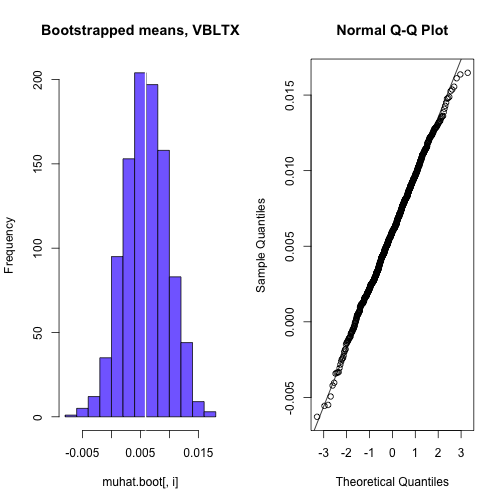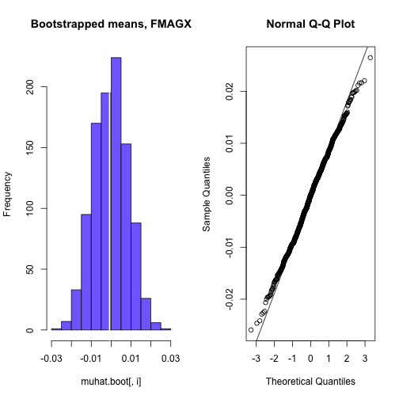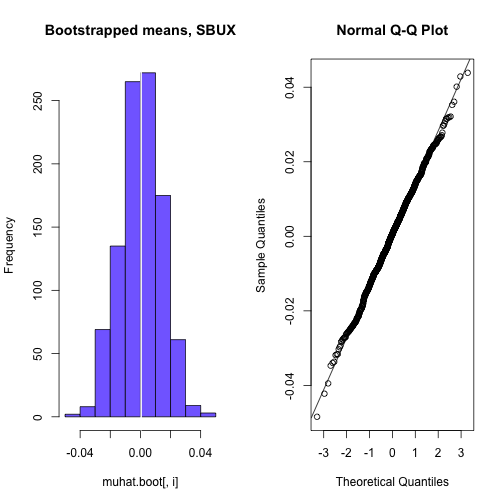


#### `^sigma_i`, Using R's boot package:


```r
    library(boot)
    
    # -rx- bootstrap separately in order to see separate plots
    # sd.boot.fun = function(x, idx) {
    #     apply(x[idx,], 2, sd)
    # }

    # sigmahat.boot = boot(data=return_matrix, 
    #                      statistic=sd.boot.fun,
    #                      R=999)
    
    # SE(^sigma_i) ~= sigma_i / sqrt(2*T)
    returns.sigmahat.se <- returns.sigmahat / sqrt(2*T)

    # The analytical SE
    rbind(returns.sigmahat,
          returns.sigmahat.se)
```

```
##                          VBLTX       FMAGX        SBUX
## returns.sigmahat    0.02939430 0.067158792 0.103608310
## returns.sigmahat.se 0.00268332 0.006130731 0.009458101
```

```r
    # bootstrap each asset separately in order to see separate plots.
    for (i in 1:ncol(return_matrix)) {
        sigmahat.boot = boot(data=return_matrix[,i], 
                             statistic=function(x,idx) { sd(x[idx]) },
                             R=999)
        print(sigmahat.boot)
        plot(sigmahat.boot)
    }
```

```
## 
## ORDINARY NONPARAMETRIC BOOTSTRAP
## 
## 
## Call:
## boot(data = return_matrix[, i], statistic = function(x, idx) {
##     sd(x[idx])
## }, R = 999)
## 
## 
## Bootstrap Statistics :
##      original        bias    std. error
## t1* 0.0293943 -0.0005873967 0.004179977
```

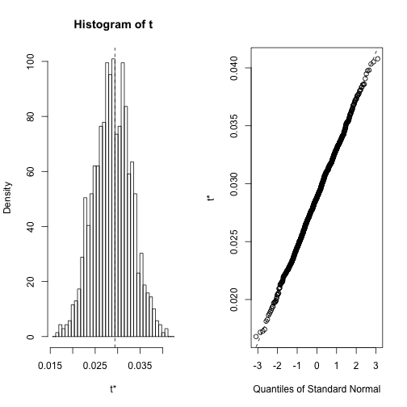

```
## 
## ORDINARY NONPARAMETRIC BOOTSTRAP
## 
## 
## Call:
## boot(data = return_matrix[, i], statistic = function(x, idx) {
##     sd(x[idx])
## }, R = 999)
## 
## 
## Bootstrap Statistics :
##       original        bias    std. error
## t1* 0.06715879 -0.0009793181 0.008910002
```

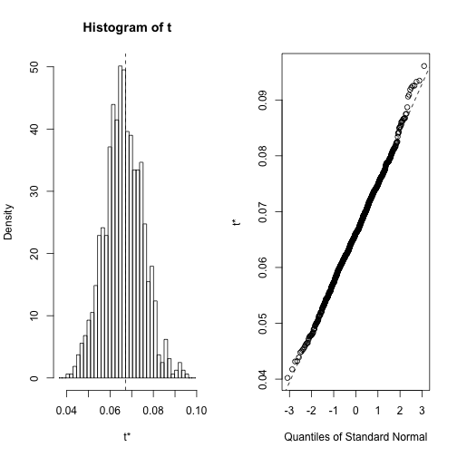

```
## 
## ORDINARY NONPARAMETRIC BOOTSTRAP
## 
## 
## Call:
## boot(data = return_matrix[, i], statistic = function(x, idx) {
##     sd(x[idx])
## }, R = 999)
## 
## 
## Bootstrap Statistics :
##      original       bias    std. error
## t1* 0.1036083 -0.001575087  0.01360379
```

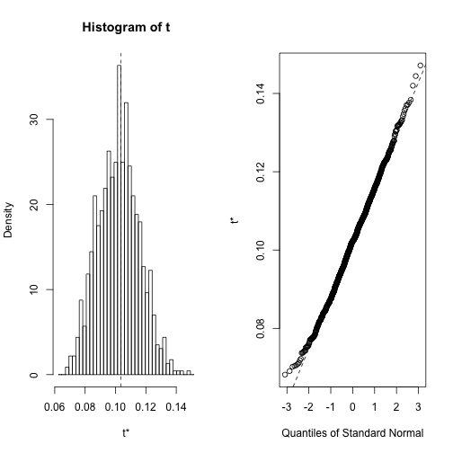

#### `rho_ij`, Using R's boot package


```r
    # -rx- boot + plot them separately
    # rhohat.boot = boot(data=return_matrix, 
    #                    statistic=function(x,idx) {
    #                        cor.mat <- cor(x[idx,])
    #                        cor.mat[lower.tri(cor.mat)]
    #                    },
    #                    R=999)

    # rhohat.boot
    # returns.rhohat
    # returns.rhohat.se

    # plot(rhohat.boot)

    returns.rhohat
```

```
## FMAGX,VBLTX  SBUX,VBLTX  SBUX,FMAGX 
##   0.1874161  -0.1355169   0.6130615
```

```r
    returns.rhohat.se
```

```
## FMAGX,VBLTX  SBUX,VBLTX  SBUX,FMAGX 
##  0.12456485  0.12672856  0.08057814
```

```r
    boot.fun = function(x,idx) {
        cor.mat <- cor(x[idx,])
        cor.mat[1,2]
    }

    # bootstrap each correlation separately in order to see the separate plots
    # 1.
    rhohat.boot = boot(data=return_matrix[, c("VBLTX","FMAGX")], 
                       statistic=boot.fun,
                       R=999)
    rhohat.boot
```

```
## 
## ORDINARY NONPARAMETRIC BOOTSTRAP
## 
## 
## Call:
## boot(data = return_matrix[, c("VBLTX", "FMAGX")], statistic = boot.fun, 
##     R = 999)
## 
## 
## Bootstrap Statistics :
##      original      bias    std. error
## t1* 0.1874161 -0.02351765   0.2032137
```

```r
    plot(rhohat.boot)
```

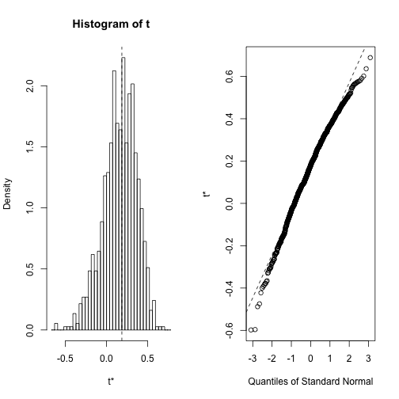

```r
    # 2.
    rhohat.boot = boot(data=return_matrix[,c("VBLTX","SBUX")], 
                       statistic=boot.fun,
                       R=999)
    rhohat.boot
```

```
## 
## ORDINARY NONPARAMETRIC BOOTSTRAP
## 
## 
## Call:
## boot(data = return_matrix[, c("VBLTX", "SBUX")], statistic = boot.fun, 
##     R = 999)
## 
## 
## Bootstrap Statistics :
##       original      bias    std. error
## t1* -0.1355169 0.007553462   0.1883153
```

```r
    plot(rhohat.boot)
```

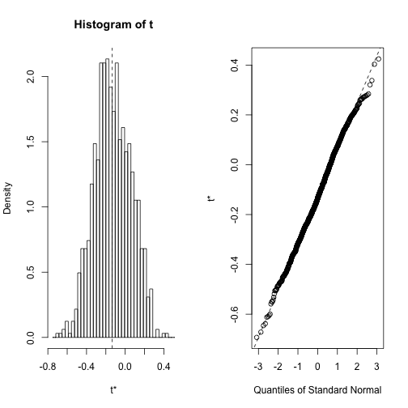

```r
    # 3.
    rhohat.boot = boot(data=return_matrix[,c("FMAGX","SBUX")], 
                       statistic=boot.fun,
                       R=999)
    rhohat.boot
```

```
## 
## ORDINARY NONPARAMETRIC BOOTSTRAP
## 
## 
## Call:
## boot(data = return_matrix[, c("FMAGX", "SBUX")], statistic = boot.fun, 
##     R = 999)
## 
## 
## Bootstrap Statistics :
##      original       bias    std. error
## t1* 0.6130615 0.0007469842  0.07351017
```

```r
    plot(rhohat.boot)
```

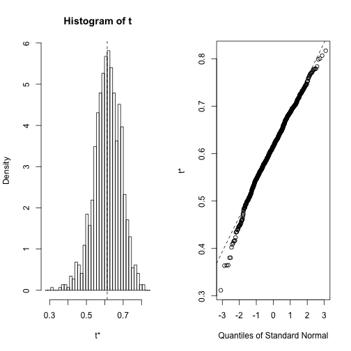

#### `5% VaR`, Using R's boot package


    # compute quantile:
    q_.05 = ^mu + ^sigma * q_.05(z)

    # Convert cc return to simple return:
    1 + R = exp(r)
    R = exp(r) - 1

    VaR_.05 = R * W0

    VaR_.05 = (exp(q_.05) - 1
    
    or, qnorm(0.05, mean=^mu, sd=^sigma)


```r
    # bootstrap each asset separately in order to see the plots.
    for (i in 1:ncol(return_matrix)) {
        var05.boot = boot(data=return_matrix[,i], 
                          statistic=function(x,idx) { 
                              muhat = mean(x[idx])
                              sigmahat = sd(x[idx])
                              q05 = muhat + sigmahat * qnorm(0.05)
                              var05 = (exp(q05) - 1)
                              var05
                          },
                          R=999)
        print(var05.boot)
        plot(var05.boot)
    }
```

```
## 
## ORDINARY NONPARAMETRIC BOOTSTRAP
## 
## 
## Call:
## boot(data = return_matrix[, i], statistic = function(x, idx) {
##     muhat = mean(x[idx])
##     sigmahat = sd(x[idx])
##     q05 = muhat + sigmahat * qnorm(0.05)
##     var05 = (exp(q05) - 1)
##     var05
## }, R = 999)
## 
## 
## Bootstrap Statistics :
##       original       bias    std. error
## t1* -0.0415635 0.0008615418 0.006800428
```

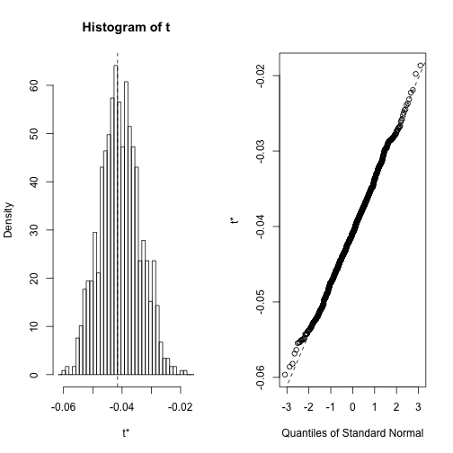

```
## 
## ORDINARY NONPARAMETRIC BOOTSTRAP
## 
## 
## Call:
## boot(data = return_matrix[, i], statistic = function(x, idx) {
##     muhat = mean(x[idx])
##     sigmahat = sd(x[idx])
##     q05 = muhat + sigmahat * qnorm(0.05)
##     var05 = (exp(q05) - 1)
##     var05
## }, R = 999)
## 
## 
## Bootstrap Statistics :
##       original      bias    std. error
## t1* -0.1053063 0.002352598  0.01834219
```

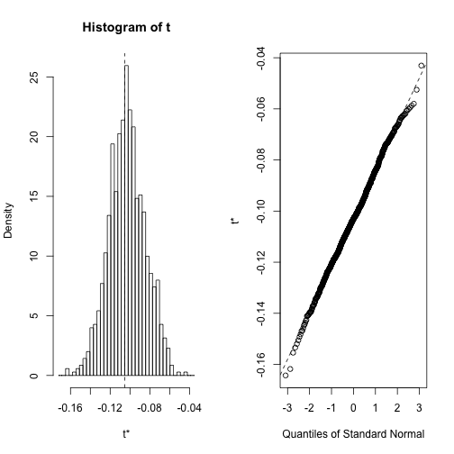

```
## 
## ORDINARY NONPARAMETRIC BOOTSTRAP
## 
## 
## Call:
## boot(data = return_matrix[, i], statistic = function(x, idx) {
##     muhat = mean(x[idx])
##     sigmahat = sd(x[idx])
##     q05 = muhat + sigmahat * qnorm(0.05)
##     var05 = (exp(q05) - 1)
##     var05
## }, R = 999)
## 
## 
## Bootstrap Statistics :
##       original    bias    std. error
## t1* -0.1562802 0.0035145  0.02319827
```

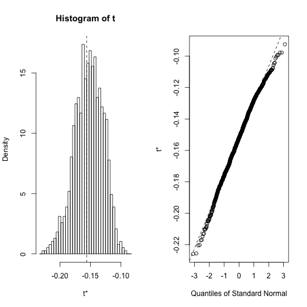


### 7\.  Under the assumptions of the Constant Expected Return Model, solve the following:

    what is E[r_i'^2], 
    
    where r_i' = 1/T * SUM_t=1..T r_it

    (You may find the relation Var(Y)=E(Y^2)−E(Y)^2 useful.)

#### ANSWER:

    Var(r') = SE(r')^2 = ( sigma/sqrt(T) )^2 
            
            = sigma^2 / T

    Var(r') = E[r'^2] - E[r']^2

    E[r'^2] = Var(r') + E[r']^2

           = sigma^2/T + mu^2


