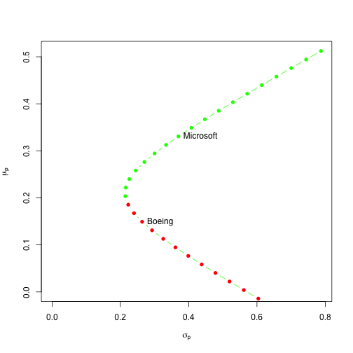
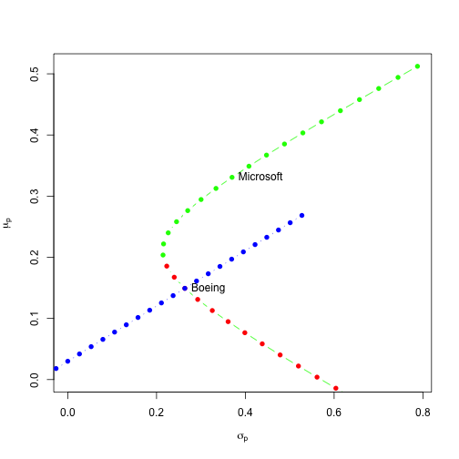
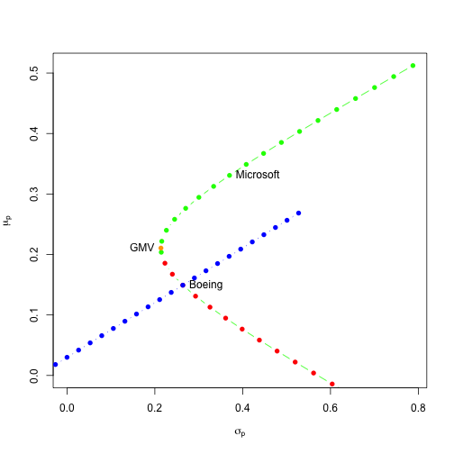
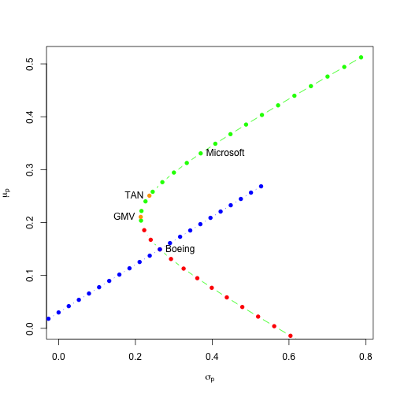
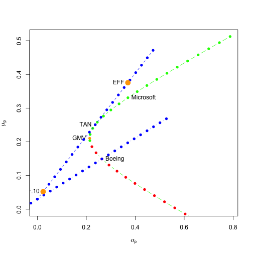

# Coursera: Intro to Computational Finance: Assignment 8: Portfolio Theory

## Load Data

[http://s3.amazonaws.com/assets.datacamp.com/course/compfin/lab8.RData](http://s3.amazonaws.com/assets.datacamp.com/course/compfin/lab8.RData)

Copied locally (binary file): [lab8.RData](lab8.RData)


```r
    library("PerformanceAnalytics")
    library("zoo")

    # defines returns_df in the workspace
    load("lab8.RData")
```

```
## Warning: namespace 'slidify' is not available and has been replaced
## by .GlobalEnv when processing object '.SLIDIFY_ENV'
```

```r
    str(returns_df)
```

```
## 'zoo' series from 1992-07-01 to 2000-10-01
##   Data: num [1:100, 1:2] 0.00313 -0.07123 -0.01351 -0.02062 -0.0246 ...
##  - attr(*, "dimnames")=List of 2
##   ..$ : NULL
##   ..$ : chr [1:2] "rboeing" "rmsft"
##   Index:  Date[1:100], format: "1992-07-01" "1992-08-01" "1992-09-01" "1992-10-01" ...
```

```r
    rbind(head(returns_df),
          tail(returns_df))
```

```
##                 rboeing       rmsft
## 1992-07-01  0.003133855  0.03853916
## 1992-08-01 -0.071232544  0.02375398
## 1992-09-01 -0.013508615  0.07745886
## 1992-10-01 -0.020622782  0.09758069
## 1992-11-01 -0.024602276  0.04811259
## 1992-12-01  0.133085160 -0.08689424
## 2000-05-01 -0.012213009 -0.10875136
## 2000-06-01  0.068034704  0.24586058
## 2000-07-01  0.154788985 -0.13621356
## 2000-08-01  0.097209033  0.00000000
## 2000-09-01  0.184357384 -0.14627370
## 2000-10-01  0.050081150  0.13275389
```


### R1: Compute mean, sd, cov, and cor of MSFT and BOEING.


```r
    # Estimate the parameters: multivariate
    mu_hat_annual <- apply(returns_df,2,mean)*12   
    sigma2_annual <- apply(returns_df,2,var)*12
    sigma_annual <- sqrt(sigma2_annual)
    
    cov_mat_annual <- cov(returns_df)*12 
    cov_hat_annual <- cov(returns_df)[1,2]*12    
    rho_hat_annual <- cor(returns_df)[1,2]
    
    # The annual estimates of the CER model parameters for Boeing and Microsoft
    mu_boeing <- mu_hat_annual["rboeing"]
    mu_msft <- mu_hat_annual["rmsft"]
    sigma2_boeing <-  sigma2_annual["rboeing"]
    sigma2_msft <- sigma2_annual["rmsft"]
    sigma_boeing <- sigma_annual["rboeing"]
    sigma_msft <- sigma_annual["rmsft"]
    sigma_boeing_msft <- cov_hat_annual
    rho_boeing_msft <- rho_hat_annual

    rbind(mu_hat_annual,
          sigma_annual)
```

```
##                 rboeing     rmsft
## mu_hat_annual 0.1492271 0.3307664
## sigma_annual  0.2636920 0.3700472
```

```r
    cov_mat_annual
```

```
##               rboeing         rmsft
## rboeing  0.0695334707 -0.0008089043
## rmsft   -0.0008089043  0.1369349559
```

```r
    rho_hat_annual
```

```
## [1] -0.00828978
```

### R2: Plot the portfolio frontier for MSFT and BOEING.


```r
    boeing_weights = seq(from=-1,to=2,by=0.1)
    msft_weights = 1 - boeing_weights

    mu_portfolio = boeing_weights * mu_boeing + msft_weights * mu_msft

    sigma2_portfolio = boeing_weights^2 * sigma_boeing^2 +
                       msft_weights^2 * sigma_msft^2 +
                       2 * boeing_weights * msft_weights * sigma_boeing_msft

    sigma_portfolio = sqrt(sigma2_portfolio)

    plot1 <- function() {
        plot(x=sigma_portfolio, 
             y=mu_portfolio, 
             type="b", 
             pch=16, 
             ylim=c(0, max(mu_portfolio)), 
             xlim=c(0, max(sigma_portfolio)), 
             xlab=expression(sigma[p]), 
             ylab=expression(mu[p]),
             col=c(rep("green", 18), rep("red", 13)))

        text(x=sigma_boeing, 
             y=mu_boeing, 
             labels="Boeing", 
             pos=4)

        text(x=sigma_msft, 
             y=mu_msft, 
             labels="Microsoft", 
             pos=4)
    }
    plot1()
```



### R3: Portfolio of Risk-Free (T-Bills) and Boeing:

#### Review: Risk-free + 1 Risky Asset

    mu_p = xf * rf + xB * mu_B 

         = (1 - xB) * rf + xB * mu_B

         = rf + xB * (mu_B - rf)

    sigma2_p = xB^2 * sigma_B^2

    sigma_p = xB * sigma_B

#### R:


```r
    t_bill_rate <- 0.03
    rf <- t_bill_rate
    
    mu_portfolio_boeing_bill <- rf + boeing_weights * (mu_boeing - rf)

    sigma_portfolio_boeing_bill <- boeing_weights * sigma_boeing

    plot2 <- function() {
        plot1()
        points(x=sigma_portfolio_boeing_bill,
               y=mu_portfolio_boeing_bill,
               type="b",
               pch=16,
               col="blue")
    }
    plot2()
```



### Question 1. What is the Sharpe slope of Boeing?

#### Review: Sharpe Slope:

    xB = sigma_p / sigma_B

    mu_p = rf + sigma_p / sigma_B * (mu_B - rf)

                (mu_B - rf)
         = rf + ----------- * sigma_p
                  sigma_B

    Sharpe Slope: (mu_B - rf)
                  -----------
                   sigma_B


#### R:


```r
    sharp_ratio_boeing <- (mu_boeing - rf) / sigma_boeing
    sharp_ratio_boeing
```

```
##   rboeing 
## 0.4521453
```


### Question 2. What is the Sharpe slope of Microsoft?


```r
    sharp_ratio_msft <- (mu_msft - rf) / sigma_msft
    sharp_ratio_msft
```

```
##     rmsft 
## 0.8127784
```

### R4: Compute the Global Minimum Variance Portfolio for MSFT and BOEING:


```r
    gmvPortfolio <- function( mu.vec, Sigma.mat) {
        # Parameters:
        #   mu.vec: expected returns for all assets
        #   Sigma.mat: covariance matrix
        #
        # Return Value:
        #   x.vec: vector of weights for each asset
        #
        #
        # Constrained optimization: Lagrangian Multipliers
        #
        # A.mat %*% z.vec = b.vec
        # z.vec = A.mat^-1 %*% b.vec
        #
        # A.mat = [ 2*Sigma  1 ]
        #         [ 1'       0 ]
        #
        # b.vec = [ 0 ]
        #         [ 0 ]
        #         [ 1 ]
        #
        # z.vec = [ x.vec  ]
        #         [ lambda ]
        N <- length(mu.vec)

        A.mat.top = cbind( 2*Sigma.mat, rep(1,N) )
        A.mat = rbind( A.mat.top, c(rep(1,N),0) )

        b.vec = c(rep(0,N),1)

        z.vec = solve(A.mat) %*% b.vec
        x.vec = z.vec[1:N,1]
        x.vec
    }

    gmv_portfolio_weights <- gmvPortfolio(mu.vec=mu_hat_annual,
                                          Sigma.mat=cov_mat_annual)

    mu_gmv_portfolio = t(gmv_portfolio_weights) %*% mu_hat_annual 

    sigma2_gmv_portfolio = t(gmv_portfolio_weights) %*% cov_mat_annual %*% gmv_portfolio_weights

    sigma_gmv_portfolio = sqrt(sigma2_gmv_portfolio)

    # global_min_var_portfolio <- list("call" = call,
	# 	                               "er" = as.vector(mu_gmv_portfolio),
	# 	                               "sd" = as.vector(sigma_gmv_portfolio),
	# 	                               "weights" = gmv_portfolio_weights)
    # class(global_min_var_portfolio) <- "portfolio"

    plot3 <- function() {
        plot2()
        points(x=sigma_gmv_portfolio,
               y=mu_gmv_portfolio,
               type="b",
               pch=16,
               col="orange")
        text(x=sigma_gmv_portfolio,
             y=mu_gmv_portfolio,
             labels="GMV",
             pos=2)
    }
    plot3()
```



```r
    # Print it all out.
    list("weights"=gmv_portfolio_weights, 
         "mu"=mu_gmv_portfolio,
         "sigma"=sigma_gmv_portfolio)
```

```
## $weights
##   rboeing     rmsft 
## 0.6619557 0.3380443 
## 
## $mu
##           [,1]
## [1,] 0.2105954
## 
## $sigma
##           [,1]
## [1,] 0.2139033
```


### Question 3. What is the Sharpe slope of the global minimum variance portfolio?


```r
    # Sharpe Ratio: (mu_p.gmv - rf) / sigma_p.gmv
    rf <- 0.03
    gmv_sharpe_ratio <- (mu_gmv_portfolio - rf) / sigma_gmv_portfolio

    # Print it all out.
    list("weights"=gmv_portfolio_weights, 
         "mu"=mu_gmv_portfolio,
         "sigma"=sigma_gmv_portfolio,
         "sharpe"=gmv_sharpe_ratio)
```

```
## $weights
##   rboeing     rmsft 
## 0.6619557 0.3380443 
## 
## $mu
##           [,1]
## [1,] 0.2105954
## 
## $sigma
##           [,1]
## [1,] 0.2139033
## 
## $sharpe
##           [,1]
## [1,] 0.8442854
```


### Question 4. What is the Sharpe slope of the tangency portfolio?


```r
    tangencyPortfolio <- function(mu.vec, Sigma.mat, rf) {
        # Parameters:
        #   mu.vec: asset expected returns
        #   Sigma.mat: asset covariance matrix
        #   rf: risk-free rate
        #
        # Return Value:
        #   t.vec: tangency portfolio weights
        #
        # Constrained optimization, maximize sharpe ratio:
        #
        #               Sigma.mat^-1 %*% (mu.vec - rf * 1)
        #     t.vec = --------------------------------------------
        #               1' %*% Sigma.mat^-1 %*% (mu.vec - rf * 1)

        one.vec <- rep(1,length(mu.vec))
        Sigma.mat.inv <- solve(Sigma.mat)

        tan.top <- Sigma.mat.inv %*% (mu.vec - rf * one.vec)
        tan.bot <- t(one.vec) %*% Sigma.mat.inv %*% (mu.vec - rf * one.vec) 

        t.vec =  tan.top[,1] / tan.bot
        t.vec
    }

    rf <- 0.03
    tan_portfolio_weights <- tangencyPortfolio( mu.vec=mu_hat_annual,
                                                Sigma.mat=cov_mat_annual,
                                                rf=0.03 )

    mu_tan_portfolio <- t(tan_portfolio_weights) %*% mu_hat_annual
    sigma_tan_portfolio <- sqrt( t(tan_portfolio_weights) %*% cov_mat_annual %*% tan_portfolio_weights )
    tan_sharpe_ratio <- (mu_tan_portfolio - rf) / sigma_tan_portfolio

    plot4 <- function() {
        plot3()
        points(x=sigma_tan_portfolio,
               y=mu_tan_portfolio,
               type="b",
               pch=16,
               col="orange")
        text(x=sigma_tan_portfolio,
             y=mu_tan_portfolio,
             labels="TAN",
             pos=2)
    }
    plot4()
```



```r
    # Print it all out.
    list("weights"=tan_portfolio_weights, 
         "mu"=mu_tan_portfolio,
         "sigma"=sigma_tan_portfolio,
         "sharpe"=tan_sharpe_ratio)
```

```
## $weights
##   rboeing     rmsft 
## 0.4409234 0.5590766 
## 
## $mu
##           [,1]
## [1,] 0.2507215
## 
## $sigma
##           [,1]
## [1,] 0.2364756
## 
## $sharpe
##           [,1]
## [1,] 0.9333793
```

### R5: Plot various combinations of the tangency portfolio and T-bills

#### Review: Mean and SD of t-bill + tangency portfolio:

    mu_p.eff <- rf * x_rf + mu_p.tan * x_tan
    sigma_p.eff <- sigma_p.tan * x_tan

#### R:


```r
    tangency_weights <- seq(from=0,to=2,by=0.1)
    t_bill_weights <- 1 - tangency_weights
    t_bill_rate <- rf <- 0.03

    mu_portfolio_tangency_bills <- t_bill_rate * t_bill_weights + mu_tan_portfolio * tangency_weights

    sigma_portfolio_tangency_bills <- tangency_weights * sigma_tan_portfolio

    plot5 <- function() {
        plot4()
        points(x=sigma_portfolio_tangency_bills,
               y=mu_portfolio_tangency_bills,
               type="b",
               col="blue",
               pch=16)
    }
    plot5()
```


    
    

### Question 5. What is the Sharpe slope of a portfolio that has 10% in the tangency portfolio and 90% in T-bills?


```r
    eff10_weights <- c(0.90, 0.10)
    mu_rf_tangency <- c(rf, mu_tan_portfolio)

    mu_eff10_portfolio <- t(eff10_weights) %*% mu_rf_tangency
    sigma_eff10_portfolio <- eff10_weights[2] * sigma_tan_portfolio

    eff10_sharpe_ratio <- (mu_eff10_portfolio - rf) / sigma_eff10_portfolio

    plot6 <- function() {
        plot5()
        points(x=sigma_eff10_portfolio,
               y=mu_eff10_portfolio,
               type="b",
               cex=2,
               col="orange",
               pch=16)
        text(x=sigma_eff10_portfolio,
             y=mu_eff10_portfolio,
             labels="EFF.10",
             pos=2)
    }
    plot6()
```


```r
    # Print it all out.
    list("mu"=mu_eff10_portfolio,
         "sigma"=sigma_eff10_portfolio,
         "sharpe"=eff10_sharpe_ratio)
```

```
## $mu
##            [,1]
## [1,] 0.05207215
## 
## $sigma
##            [,1]
## [1,] 0.02364756
## 
## $sharpe
##           [,1]
## [1,] 0.9333793
```


### Question 6. What is the Sharpe slope of the efficient portfolio (combination of T-bills and tangency portfolio) that has the same risk (SD) as Microsoft?

#### Review: Mean and SD of t-bill + tangency portfolio:

    mu_p.eff <- rf * x_rf + mu_p.tan * x_tan

    sigma_p.eff <- sigma_p.tan * x_tan

    x_tan = sigma_p.eff / sigma_p.tan
   


```r
    tangency_weight = sigma_msft / sigma_tan_portfolio
    eff_msftsd_weights <- c(1-tangency_weight, tangency_weight)
    names(eff_msftsd_weights) <- c("t-bills","tangency")

    mu_eff_msftsd_portfolio <- t(eff_msftsd_weights) %*% mu_rf_tangency
    sigma_eff_msftsd_portfolio <- tangency_weight * sigma_tan_portfolio

    eff_msftsd_sharpe_ratio <- (mu_eff_msftsd_portfolio - rf) / sigma_eff_msftsd_portfolio

    plot7 <- function() {
        plot6()
        points(x=sigma_eff_msftsd_portfolio,
               y=mu_eff_msftsd_portfolio,
               col="orange",
               type="b",
               cex=2,
               pch=16)
        text(x=sigma_eff_msftsd_portfolio,
             y=mu_eff_msftsd_portfolio,
             labels="EFF",
             pos=2)
    }
    plot7()
```



```r
    # Print it all out.
    list("weights"=eff_msftsd_weights,
         "mu"=mu_eff_msftsd_portfolio,
         "sigma"=sigma_eff_msftsd_portfolio,
         "sharpe"=eff_msftsd_sharpe_ratio)
```

```
## $weights
##    t-bills   tangency 
## -0.5648429  1.5648429 
## 
## $mu
##           [,1]
## [1,] 0.3753944
## 
## $sigma
##           [,1]
## [1,] 0.3700472
## 
## $sharpe
##           [,1]
## [1,] 0.9333793
```

### Question 7. What is the portfolio weight of Microsoft in the global minimum variance portfolio?


```r
    gmv_portfolio_weights["rmsft"]
```

```
##     rmsft 
## 0.3380443
```

### Question 8. What is the portfolio weight of Microsoft in the tangency portfolio?


```r
    tan_portfolio_weights["rmsft"]
```

```
##     rmsft 
## 0.5590766
```


### Question 9. What is the expected return of the efficient portfolio (combination of T-bills and tangency portfolio) that has the same risk (SD) as Microsoft?


```r
    mu_eff_msftsd_portfolio
```

```
##           [,1]
## [1,] 0.3753944
```

### Question 10. For the efficient portfolio (combination of T-bills and tangency portfolio) that has the same risk (SD) as Microsoft, what is the percentage of wealth invested into T-bills?


```r
    eff_msftsd_weights
```

```
##    t-bills   tangency 
## -0.5648429  1.5648429
```
