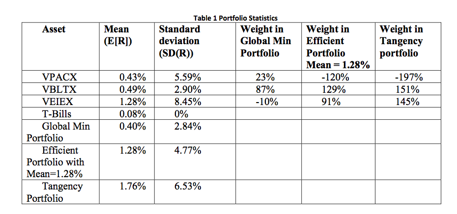
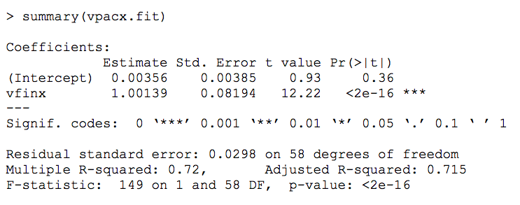
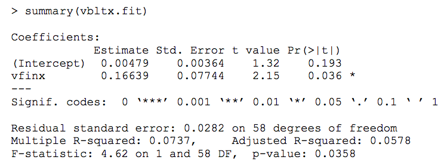
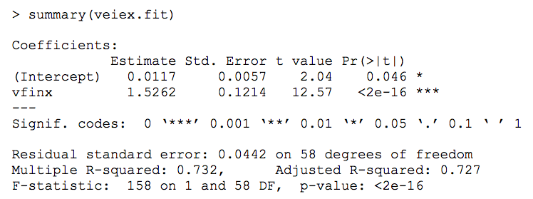

# Coursera: Intro to Computational Finance: Final Exam

### 1. What is the annualized continuously compounded mean of vpacx?

    mu_vpacx = 0.43
    sigma_vpacx = 5.59

    mu_vpacx_a = 12 * mu_vpacx
    mu_vpacx_a
    # [1] 5.16

### 2. What is the annualized standard deviation of vpacx?

    sigma_vpacx_a = sqrt(12) * sigma_vpacx
    sigma_vpacx_a 
    # [1] 19.36433

### 3. What is the annualized sharpe ratio of vpacx? 

    rf = 0.08
    rf_a = 12 * rf
    sharpe_vpacx_a = (mu_vpacx_a - rf_a) / sigma_vpacx_a
    sharpe_vpacx_a 
    # [1] 0.2168937

### 4. What is the annualized continuously compounded mean of vbltx?

    mu_vbltx = 0.49
    sigma_vbltx = 2.90

    mu_vbltx_a = 12 * mu_vbltx
    mu_vbltx_a 
    # [1] 5.88

### 5. What is the annualized standard deviation of vbltx?

    sigma_vbltx_a  = sqrt(12) * sigma_vbltx
    sigma_vbltx_a  
    # [1] 10.04589

### 6. What is the annualized sharpe ratio of vbltx? 

    sharpe_vbltx_a = (mu_vbltx_a - rf_a) / sigma_vbltx_a
    sharpe_vbltx_a 
    # [1] 0.4897523

### 7. What is the annualized continuously compounded mean of veiex?

    mu_veiex = 1.28
    sigma_veiex = 8.45

    mu_veiex_a = 12 * mu_veiex
    mu_veiex_a 
    # [1] 15.36

### 8. What is the annualized standard deviation of veiex?

    sigma_veiex_a = sqrt(12) * sigma_veiex
    sigma_veiex_a 
    # [1] 29.27166

### 9. What is the annualized sharpe ratio of veiex? 

    sharpe_veiex_a = (mu_veiex_a - rf_a) / sigma_veiex_a
    sharpe_veiex_a 
    [1] 0.4919434

### 10. Find the efficient portfolio of risky assets only that has an expected monthly return equal to 1%. 
    
In this portfolio, how much is invested in vpacx, vbltx, and veiex?

#### Review: Finding efficient portfolios via convex combo of two efficient portfolios

    # mu_p,z = alpha * mu_p,x + (1 - alpha) * mu_p,y = 0.05
    # 
    # 
    #          mu_p,z - mu_p,y
    # alpha = ------------------ 
    #          mu_p,x - mu_p,y
    # 
    # z = alpha * x + (1 - alpha) * y

#### R:

    mu_p.gmv <- 0.40
    sigma_p.gmv <- 2.84

    asset_names <- c("vpacx", "vbltx", "veiex")
    gmv.weights <- c(0.23, 0.87, -0.10) 
    names(gmv.weights) <- asset_names

    mu_p.eff1 <- 1.28
    sigma_p.eff1 <- 4.77
    eff1.weights <- c(-1.20, 1.29, 0.91)
    name(eff1.weights) <- asset_names

    mu_p.tan <- 1.76
    sigma_p.tan <- 6.53
    tan.weights <- c(-1.97, 1.51, 1.45)
    names(tan.weights) <- asset_names

    mu_p.x <- mu_p.gmv
    x <- gmv.weights

    mu_p.y <- mu_p.eff1
    y <- eff1.weights

    mu_p.z <- 1

    alpha = (mu_p.z - mu_p.y) / (mu_p.x - mu_p.y)

    z = alpha * x + (1 - alpha) * y
    z
    #      vpacx      vbltx      veiex 
    # -0.7450000  1.1563636  0.5886364 

### 11. How much should be invested in T-bills and the tangency portfolio to create an efficient portfolio with expected return equal to 1%?

#### Review: efficient portfolios with rf + tangency portfolio

    mu_p.eff = rf + x_p.tan( mu_p.tan - rf)

    sigma_p.eff = x_p.tan * sigma_p.tan

    # x_p.tan = share of wealth invested in tangency portfolio
    #           (the rest in T-Bills)
    
    x_p.tan = (mu_p.eff - rf) / (mu_p.tan - rf)

#### R:

    mu_p.eff2 = 1
    x_p.tan <- (mu_p.eff2 - rf) / (mu_p.tan - rf)
    1 - x_p.tan
    # [1] 0.452381

### 12. What is the standard deviation of the efficient portfolio from the previous question?

    sigma_p.eff2 <- x_p.tan * sigma_p.tan
    sigma_p.eff2 
    # [1] 3.575952

### 13. In the efficient portfolio from the previous 2 questions, what are the shares of wealth invested in T-Bills, vpacx, vbltx, and veiex?

    x_p.tan * tan.weights
    #      vpacx      vbltx      veiex 
    # -1.0788095  0.8269048  0.7940476 

    1 - x_p.tan
    # [1] 0.452381

### 14. Assuming an initial $100,000 investment for one month, compute the 5% value-at-risk on the global minimum variance portfolio.

    r_cc = mu_p.gmv + sigma_p.gmv * qnorm(0.05)
    R = exp(r_cc/100) - 1

    W0 = 100000
    valAtRisk.05 <- W0 * R
    valAtRisk.05 
    # [1] -4181.446

----

The following represents R linear regression output from estimating the single
index model for the Vanguard Pacific Stock Index (vpacx) using monthly
continuously compounded return data over the 5 year period September 2004 –
September 2009. In the regressions, the market index is the Vanguard S&P 500
index (vfinx).

### 15. What is the estimated value of beta for vpacx? 

    beta_vpacx = 1.00139

### 16. What is the estimated standard error of beta for vpacx? 

    beta.se_vpacx = 0.08194

### 17. What is the estimate of sigma_err for vpacx? 

    0.0298

### 18. What is the R^2 for the regression for vpacx? 

    R2_vpacx = 0.72

---

The following represents R linear regression output from estimating the single
index model for the Vanguard long-term bond index (vbltx) using monthly
continuously compounded return data over the 5 year period September 2004 –
September 2009. In the regressions, the market index is the Vanguard S&P 500
index (vfinx).

### 19.  What is the estimated value of beta for vbltx? 

    beta_vbltx = 0.16639

### 20. What is the estimated standard error of beta for vbltx? 

    beta.se_vbltx = 0.07744

### 21. What is the estimate of sigma_err for vbltx? 

    0.0282

### 22. What is the R^2 for the regression for vbltx?

    R2_vbltx = 0.0737

---

The following represents R linear regression output from estimating the single
index model for the Vanguard Emerging Markets Fund (veiex) using monthly
continuously compounded return data over the 5 year period September 2004 –
September 2009. In the regressions, the market index is the Vanguard S&P 500
index (vfinx).

### 23. What is the estimated value of beta for veiex? 

    beta_veiex = 1.5262

### 24. What is the estimated standard error of beta for veiex? 

    beta.se_veiex = 0.1214

### 25. What is the estimate of sigma_err for veiex? 

    0.0442

### 26. What is the R^2 for the regression for veiex? 

    R2_veiex = 0.732

### 27. What is the percentage of total risk not due to the market (diversifiable risk) for vpacx?

    1 - R2_vpacx

### 28. What is the percentage of total risk not due to the market (diversifiable risk) for vbltx?

    1 - R2_vbltx

### 29. What is the percentage of total risk not due to the market (diversifiable risk) for veiex?

    1 - R2_veiex

### 30. Which asset is riskiest relative to the S&P 500?

    beta_vpacx = 1.00139
    beta_vbltx = 0.16639
    beta_veiex = 1.5262

    Highest beta: veiex

### 31. Which asset is most beneficial to hold in terms of diversification?
    
    Lowest beta: vbltx

### 32. For each asset, test the null hypothesis that beta = 1 against the alternative that beta != 1 using a 5% significance level. 
    
For which assets do you reject the null hypothesis?

    #           ^Beta_i - 1
    # t.stat = -------------
    #           ^SE(^Beta_i)

    beta_vpacx = 1.00139
    beta_vbltx = 0.16639
    beta_veiex = 1.5262

    beta.se_vpacx = 0.08194
    beta.se_vbltx = 0.07744
    beta.se_veiex = 0.1214

    t.stat_vpacx = (beta_vpacx - 1) / beta.se_vpacx
    t.stat_vbltx = (beta_vbltx - 1) / beta.se_vbltx
    t.stat_veiex = (beta_veiex - 1) / beta.se_veiex

    t.stat_vpacx 
    # [1] 0.01696363        

    t.stat_vbltx 
    # [1] -10.76459     # REJECT

    t.stat_veiex 
    # [1] 4.334432      # REJECT

    

### 33. Using the information listed in Question 1, what is the beta of the global minimum variance portfolio?

    # Beta_p = x1 * Beta_1 + x2 * Beta_2 + ...

    gmv.betas <- c(beta_vpacx, beta_vbltx, beta_veiex)
    names(gmv.betas) <- asset_names
    
    beta_p.gmv <- t(gmv.weights) %*% gmv.betas
    beta_p.gmv
    # 0.222459

