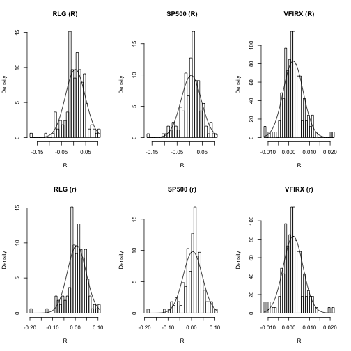
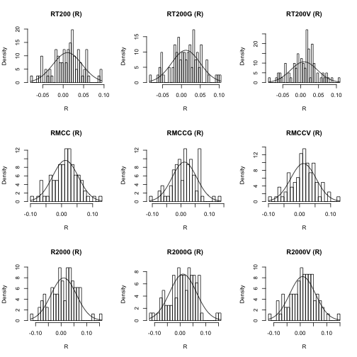
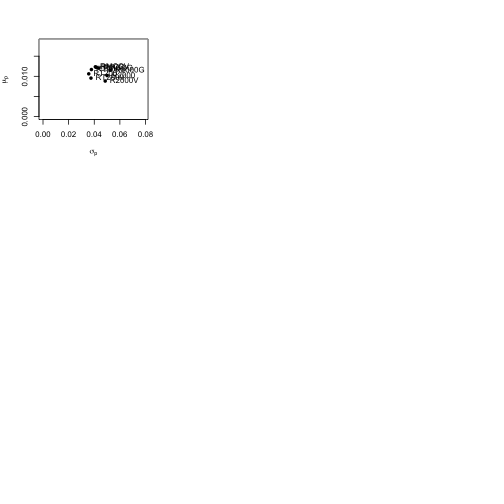

# Portfolio Analysis of My 401K

TODO: Research all funds
      Full return history
      Recent return history
      Recession return history

TODO: Portfolio Analysis on all funds

1. get all fund symbols from netbenefits.com
2. download historical fund price data from yahoo
3. analyze "normality" of monthly and daily returns
4. do basic portfolio analysis using CER model and sample stats
    * subtract fees from fund performance
    * note: some funds overlap.
        * this breaks IID assumption
    * adjust for divs? inflation?
5. determine sharpe ratios for all funds
6. determine MCR for all funds


## My Investments

* LARGE COMPANY IDX
    * Tracks the S&P500 (^GSPC)
    * 28.70%
* LARGE-CAP GROWTH IDX
    * Tracks Russell 1000 Growth Index (symbol: ^RLG, VRGWX)
    * 28.55%
* VANG ST TREASURY ADM (VFIRX)
    * Short-term Govt Bonds
    * 23.97%
* MODERATE LS
    * Weight: 18.78%
    * 12% Inflation Protected Bond Fund
        * Tracks Barclays U.S. Treasury Inflation Protected Securities - Series L Index.
    * 20% Total Bond Market & Interest Income Funds
        * Total Bond Market: Tracks Barclays U.S. Aggregate Bond Index
        * Interest Income Fund: ?
    * 3% High Yield & Emerging Markets Bond Fund
        * ?
    * 6% Real Estate Investment Trust Index Fund
    * 2% International Real Estate Index Fund
    * 10% Balanced Exposure Fund
    * 3% Commodities Fund
    * 31% Total Stock Market Index Fund 
    * 13% Total International Stock Market Index Fund. 
    * State Street Global Advisors periodically rebalances the fund to the target allocations.


## Russell Indices:


* Russell 3000 Index 
    * 1-3000
    * Top 3000 U.S. companies (98% of investable market)
    * ^RUA, ^RAG, ^RAV
* Russell 2500 Index
    * 501-3000
    * bottom 2,500 stocks in the Russell 3000 Index.
* Russell 2000 Index 
    * 1001-2000
    * The small-cap benchmark index of the bottom 2,000 stocks in the Russell 3000 Index.
    * ^RUT, ^RUO, ^RUJ 
* Russell 1000 Index 
    * 1-1000
    * The large-cap index of the top 1,000 stocks in the Russell 3000 Index.
    * ^RUI, ^RLG, ^RLV 
* Russell Top 200 Index 
    * 1-200
    * The mega-cap index of the very largest 200 stocks in the Russell 3000 Index.
    * ^RT200, ^RT200G, ^RT200V: 
* Russell Top 50 Index 
    * 1-50
    * Measures the performance of the 50 largest companies in the Russell 3000 Index.
    * ^RU50 
* Russell Midcap Index 
    * 201-1000
    * The bottom 800 stocks in the Russell 1000 Index. The Russell Top 200 Index plus the Russell Midcap Index yields the Russell 1000 Index.
    * ^RMCC, ^RMCCG, ^RMCCV
* Russell Microcap Index
    * 2001-4000
    * A micro-cap index of the stocks ranked from 2,001-4,000 in the Russell indexing universe, consisting of capitalizations ranging from about $50 million to $2.5 billion. Hence, this is an index of the 1,000 smallest Russell 3000 stocks, plus the 1,000 smaller stocks.
    * ^RUMIC, ^RUMICG, ^RUMICV
* Russell Small Cap Completeness Index 
    * ~501-3000
    * Top 3000 minus SP500

## Simple vs. CC (log) Returns

* Distributions:
    * monthly cc returns tend to approximate normal distribution
    * better than daily cc returns
    * normal distribution may not be suitable for simple returns
        * since normal distribution allows for impossible simple returns
            * e.g. `R < -1`
* cc return ~= simple return, for small values of R
* multi-period cc returns are ADDITIVE
    * linear combinations of normally distributed random variables
        * are ALSO normally distributed random variables
    * aggregation of multi-period cc returns is the same as...
        * linear combination of normally-distributed random variables
* multi-period simple returns are NOT additive
    * however they are approximately additive for small values of R
* CER model assumes IID normally distributed CC returns
* Portfolio theory typically uses simple returns
    * since portfolio return is linear combo of simple returns


## Load data


```r
    library(tseries)    # get.hist.quote
    library(zoo)        # coredata
    library(quadprog)   # solve.QP

    #
    # Load price data from yahoo
    #
    VFIRX_prices <- get.hist.quote(instrument="vfirx", 
                                  start="2001-01-01",
                                  end="2016-12-31", 
                                  quote="AdjClose",
                                  provider="yahoo", 
                                  origin="1970-01-01",
                                  compression="m", 
                                  retclass="zoo", 
                                  quiet = TRUE)
    RLG_prices <- get.hist.quote(instrument="^rlg", 
                                  start="2001-01-01",
                                  end="2016-12-31", 
                                  quote="AdjClose",
                                  provider="yahoo", 
                                  origin="1970-01-01",
                                  compression="m", 
                                  retclass="zoo", 
                                  quiet = TRUE)
    SP500_prices <- get.hist.quote(instrument="^gspc", 
                                   start="2001-01-01",
                                   end="2016-12-31", 
                                   quote="AdjClose",
                                   provider="yahoo", 
                                   origin="1970-01-01",
                                   compression="m", 
                                   retclass="zoo", 
                                   quiet = TRUE)

    #
    # Compute simple returns, means, sd, cov
    # Portfolio theory assumes simple returns (as opposed to cc returns)
    # 
    all_prices <- merge(RLG_prices, SP500_prices, VFIRX_prices)

    # diff: computes pt1 - pt0
    # lag: shifts all_prices by k=-1 (so that pt-1 -> pt)
    simple_returns <- diff(all_prices) / lag(all_prices,k=-1)
    
    # zoo :: na.omit: removes rows with any NAs
    simple_returns <- na.omit(simple_returns)       
    simple_returns.mat <- coredata(simple_returns)

    log_returns <- log(1 + simple_returns)
    log_returns.mat <- coredata(log_returns)

    asset_names <- c("RLG", "SP500", "VFIRX")
    colnames(simple_returns.mat) <- asset_names
    colnames(log_returns.mat) <- asset_names

    simple_returns.df <- as.data.frame(simple_returns.mat)
    log_returns.df <- as.data.frame(log_returns.mat)

    dim(simple_returns.mat)
```

```
## [1] 165   3
```

```r
    rbind( head(simple_returns.mat),
           tail(simple_returns.mat) )
```

```
##                 RLG         SP500         VFIRX
##         0.053297208  0.0570696209 -0.0073317765
##        -0.070316439 -0.0603325727  0.0134428342
##        -0.024983592 -0.0274146926 -0.0010084032
##        -0.005921770 -0.0170036085  0.0079784500
##         0.017645397  0.0083575686  0.0015205479
##         0.073324989  0.0810441069  0.0012178003
## [160,] -0.002331766 -0.0041283604  0.0015848425
## [161,]  0.065847184  0.0659911146  0.0027017316
## [162,] -0.010037385  0.0026993985 -0.0001852721
## [163,]  0.017549681  0.0153246024 -0.0008352756
## [164,] -0.005363081  0.0009109211  0.0065237651
## [165,]  0.003651034  0.0019486025 -0.0009259259
```

```r
    rbind( head(log_returns.mat),
           tail(log_returns.mat) )
```

```
##                 RLG         SP500         VFIRX
##         0.051925442  0.0555005713 -0.0073587861
##        -0.072911008 -0.0622292670  0.0133532810
##        -0.025300980 -0.0277974876 -0.0010089120
##        -0.005939374 -0.0171498298  0.0079467905
##         0.017491525  0.0083228375  0.0015193931
##         0.070761296  0.0779273397  0.0012170594
## [160,] -0.002334489 -0.0041369056  0.0015835880
## [161,]  0.063769961  0.0639049904  0.0026980885
## [162,] -0.010088100  0.0026957616 -0.0001852892
## [163,]  0.017397464  0.0152083666 -0.0008356247
## [164,] -0.005377514  0.0009105065  0.0065025775
## [165,]  0.003644385  0.0019467064 -0.0009263549
```

```r
    mu.vec <- apply(simple_returns.mat, 2, mean)
    sigma.vec <- apply(simple_returns.mat, 2, sd)

    rbind(mu.vec,
          sigma.vec)
```

```
##                   RLG       SP500       VFIRX
## mu.vec    0.006896788 0.006068974 0.002123576
## sigma.vec 0.041058351 0.040157969 0.004810538
```

```r
    sigma.mat <- cov(simple_returns.mat)
    rho.mat <- cor(simple_returns.mat)
    rbind(sigma.mat,
          rho.mat)
```

```
##                RLG         SP500         VFIRX
## RLG    0.001685788  1.608030e-03 -5.276200e-05
## SP500  0.001608030  1.612662e-03 -4.842709e-05
## VFIRX -0.000052762 -4.842709e-05  2.314128e-05
## RLG    1.000000000  9.752608e-01 -2.671321e-01
## SP500  0.975260820  1.000000e+00 -2.506819e-01
## VFIRX -0.267132097 -2.506819e-01  1.000000e+00
```

## Explore simple and CC return distributions


```r
    # plot histograms of simple and log returns
    par(mfrow=c(2,3))
    tmp <- mapply(function(R, asset_name) { 
                      hist(R, 
                           breaks=30, 
                           main=paste(asset_name,"(R)"),
                           probability=T) 
                      x <- seq(min(R), max(R), length.out=100)
                      curve(dnorm(x, mean=mean(R), sd=sd(R)), add=T)
                  },
                  simple_returns.df, 
                  names(simple_returns.df) )

    tmp <- mapply(function(R, asset_name) { 
                      hist(R, 
                           breaks=30, 
                           main=paste(asset_name,"(r)"),
                           probability=T) 
                      x <- seq(min(R), max(R), length.out=100)
                      curve(dnorm(x, mean=mean(R), sd=sd(R)), add=T)
                  },
                  log_returns.df, 
                  names(log_returns.df) )
```



## Generate Mean-Variance plot of portfolios


```r
    par(mfrow=c(1,1))

    #
    # plot and label assets
    #
    plot(x=sigma.vec,
         y=mu.vec,
         pch=16, 
         ylim=c(0, max(mu.vec) * 1.5), 
         xlim=c(0, max(sigma.vec) *1.5), 
         xlab=expression(sigma[p]), 
         ylab=expression(mu[p]))
    text(x=sigma.vec,
         y=mu.vec,
         labels=names(sigma.vec),
         pos=4)

    #
    # plot and label GMV Portfolio (no shorting)
    #
    source("../my.portfolio.r")
    gmv.portfolio.weights <- gmvPortfolio.noShort( mu.vec, sigma.mat )
    gmv.portfolio.mu <- t(gmv.portfolio.weights) %*% mu.vec
    gmv.portfolio.sigma <- sqrt( t(gmv.portfolio.weights) %*% sigma.mat %*% gmv.portfolio.weights )

    points(x=gmv.portfolio.sigma,
           y=gmv.portfolio.mu,
           pch=16,
           col="blue")
    text(x=gmv.portfolio.sigma,
         y=gmv.portfolio.mu,
         labels="GMV",
         pos=2)

    #
    # plot the efficient frontier (no shorting)
    #
    eff.frontier.weights <- effFrontier.noShort(mu.vec, 
                                                sigma.mat, 
                                                target.return.vec=seq(gmv.portfolio.mu, max(mu.vec), length.out=10))
    eff.frontier.mus <- apply(eff.frontier.weights,
                              1,
                              function(x.vec) { t(x.vec) %*% mu.vec })

    eff.frontier.sigmas <- apply(eff.frontier.weights,
                                 1,
                                 function(x.vec) { sqrt(t(x.vec) %*% sigma.mat %*% x.vec) })

    points(x=eff.frontier.sigmas,
           y=eff.frontier.mus,
           pch=16,
           col="green")

    #
    # plot my current allocations
    #
    my.port.weights <- c(0.2855, 0.2870, 0.2397)
    my.port.weights <- my.port.weights + (1 - sum(my.port.weights))/length(my.port.weights)
    my.port.mu <- t(my.port.weights) %*% mu.vec
    my.port.sigma <- sqrt( t(my.port.weights) %*% sigma.mat %*% my.port.weights )

    points(x=my.port.sigma,
           y=my.port.mu,
           pch=16,
           col="blue")
    text(x=my.port.sigma,
         y=my.port.mu,
         labels="ME",
         pos=2)
```


## Analyze Large, Mid, Small-cap indexes


```r
    getQuote <- function(symbol) {
        get.hist.quote(instrument=symbol,
                       start="2001-01-01",
                       end="2016-12-31", 
                       quote="AdjClose",
                       provider="yahoo", 
                       origin="1970-01-01",
                       compression="m", 
                       retclass="zoo", 
                       quiet = TRUE)
    }

    #
    # @param symbols - vector of symbol names
    # 
    # @return historical quotes for all symbols merged into a single zoo data frame
    #
    getUniverse <- function(symbols) {
        retMe <- lapply(symbols, getQuote)
        retMe.merged <- do.call(merge, retMe)
        names(retMe.merged) <- symbols
        retMe.merged
    }

    #
    # 1. Load universe
    #
    asset_symbols <- c("IWL", # ishares ETF (historical index data not available)
                       "IWY",
                       "IWX",
                       "IWR",
                       "IWP",
                       "IWS",
                       "^RUT",
                       "^RUO",
                       "^RUJ")

    asset_names <- c("RT200",
                     "RT200G",
                     "RT200V",
                     "RMCC",
                     "RMCCG",
                     "RMCCV",
                     "R2000",
                     "R2000G",
                     "R2000V")

    univ <- getUniverse(asset_symbols)
    names(univ) <- asset_names

    #
    # 2. Compute returns, mu, sigma
    # 
    # diff: computes pt1 - pt0
    # lag: shifts all_prices by k=-1 (so that pt-1 -> pt)
    univ.simple.returns <- diff(univ) / lag(univ,k=-1)
    univ.simple.returns <- na.omit(univ.simple.returns)

    mu.vec <- sapply(univ.simple.returns, mean)
    sigma.vec <- sapply(univ.simple.returns, sd)

    rbind(mu.vec,
          sigma.vec)
```

```
##                RT200     RT200G      RT200V       RMCC      RMCCG
## mu.vec    0.01061419 0.01168296 0.009552557 0.01223570 0.01203028
## sigma.vec 0.03570002 0.03777973 0.037439514 0.04151581 0.04327634
##                RMCCV      R2000     R2000G      R2000V
## mu.vec    0.01235936 0.01016898 0.01151568 0.008822989
## sigma.vec 0.04084283 0.05006373 0.05254961 0.048546055
```

```r
    #
    # 3. plot histograms of simple and log returns
    #
    par(mfrow=c(3,3))
    tmp <- mapply(function(R, asset_name) { 
                      hist(R, 
                           breaks=30, 
                           main=paste(asset_name,"(R)"),
                           probability=T) 
                      x <- seq(min(R), max(R), length.out=100)
                      curve(dnorm(x, mean=mean(R), sd=sd(R)), add=T)
                  },
                  as.data.frame(univ.simple.returns),
                  names(univ.simple.returns) )
```



```r
    #
    # 4. Generate mean-var plot 
    #
    plot(x=sigma.vec,
         y=mu.vec,
         pch=16, 
         ylim=c(0, max(mu.vec) * 1.5), 
         xlim=c(0, max(sigma.vec) *1.5), 
         xlab=expression(sigma[p]), 
         ylab=expression(mu[p]))
    text(x=sigma.vec,
         y=mu.vec,
         labels=names(sigma.vec),
         pos=4)
```




